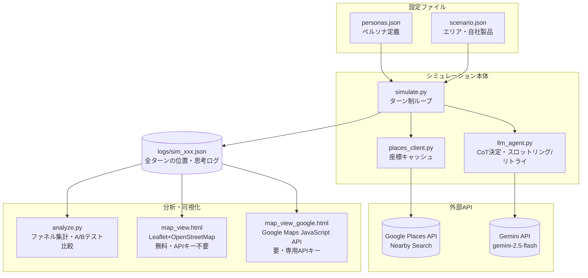

# 260701 — AI箱庭（生成エージェント × 実在地図 購買行動シミュレーション）

複数のAIペルソナを実在の地図（渋谷駅周辺）上で1日分行動させ、自社製品（架空のコーヒーショップ）をどうすれば買ってもらえるかを分析するシミュレーション。

スタンフォード大学の「Generative Agents」研究に近いアプローチをビジネス課題（購買行動分析）に応用したもの。実装方針は、Python製の軽量ターン制シミュレータ（v1）として構築し、A/Bテストと思考ログ（Chain of Thought）のJSON化による失注理由の定量化を組み込んでいる。

---

## 仕組み

1ターン＝1時間として、各ペルソナごとに以下を繰り返す。

```
[現在地] → Places APIで周辺施設を取得 → 自社店舗を候補に追加
    → LLMに「次にどこへ行くか」をCoT付きJSONで決定させる
    → 結果をログに記録、位置を更新
```

LLMの出力は以下の形式で構造化されている（失注理由の集計に使う）:

```json
{
  "situation_assessment": "現在の状況をどう認識しているか",
  "options_considered": ["検討した選択肢"],
  "considered_our_product": true,
  "choice_index": 2,
  "action_type": "move",
  "interest_in_our_product": 6,
  "reason": "自社製品は気になったが、価格が予算より高く感じたため見送った"
}
```

---

## システム構成図



**データの流れ**: `simulate.py`が`personas.json`/`scenario.json`を読み込み→1ターンごとに`places_client.py`経由でPlaces APIから周辺施設を取得→`llm_agent.py`経由でGemini APIに行動を決定させる→結果を`logs/`にJSONとして保存。保存後は`analyze.py`（集計）または`map_view*.html`（地図再生）が、このJSONファイルだけを読んで動作する（再実行時にAPIへ再アクセスする必要はない）。

---

## 必要なAPIキー

| 環境変数 | 用途 | 取得元 |
|---------|------|--------|
| `GOOGLE_API_KEY`（または`GEMINI_API_KEY`） | ペルソナの意思決定（Gemini API） | [Google AI Studio](https://aistudio.google.com/)（無料枠あり） |
| `GOOGLE_MAPS_API_KEY` | 周辺施設の取得（Places API Nearby Search） | [Google Cloud Console](https://console.cloud.google.com/)（要課金有効化。SKUごとに無料枠あり） |
| （任意）Maps JavaScript APIキー | `map_view_google.html`で実際のGoogle Map上に再生表示する場合のみ必要 | 同上。Places API用キーとは別キーを推奨（用途・制限方式が異なるため） |

```bash
export GOOGLE_API_KEY="your-gemini-api-key"
export GOOGLE_MAPS_API_KEY="your-maps-api-key"
```

**Places APIについて**: Google Cloud Consoleで請求先アカウントを有効化し、「Places API」を有効にしたAPIキーが必要。自社店舗（架空）はPlaces APIには存在しないため、`scenario.json`の`store_location`を使って常に候補リストに追加している。

**料金について（2026年6月時点）**: 2025年3月に、従来の「月$200クレジット」が廃止され、SKU（APIの種類）ごとの無料利用枠に変更された。Nearby Search（Legacy）が属するEssentials SKUは月10,000リクエストまで無料、それを超えると従量課金（リクエスト内容により$2〜数十ドル/1,000件）。今回の小規模構成（3ペルソナ×14ターン、座標キャッシュあり）なら無料枠内に収まる見込みだが、繰り返し実行する場合は[Google Cloud Consoleの課金ダッシュボード](https://console.cloud.google.com/billing)で実際の使用量を確認すること。詳細は[Places API Usage and Billing](https://developers.google.com/maps/documentation/places/web-service/usage-and-billing)を参照。

---

## ファイル構成

| ファイル | 役割 |
|---------|------|
| [personas.json](./personas.json) | ペルソナ定義（3体: 会社員・経営者・大学生、性格・予算・ニーズが異なる） |
| [scenario.json](./scenario.json) | シミュレーション対象エリア・自社製品情報・実施日時 |
| [places_client.py](./places_client.py) | Google Places API（Nearby Search）のラッパー。座標キャッシュ付き |
| [llm_agent.py](./llm_agent.py) | Gemini APIへの行動決定プロンプト生成・JSON応答パース |
| [simulate.py](./simulate.py) | シミュレーション本体（ターン制ループ） |
| [analyze.py](./analyze.py) | ログを集計し、検討率・来店率・購入率と失注理由を表示。A/Bテスト比較にも対応 |
| [map_view.html](./map_view.html) | Leaflet + OpenStreetMap（無料・APIキー不要）でシミュレーション結果を地図上に再生表示 |
| [map_view_google.html](./map_view_google.html) | 実際のGoogle Map（Maps JavaScript API）上に再生表示。専用APIキーが別途必要 |
| `logs/` | シミュレーション結果のJSONログ出力先 |

---

## 実行手順

```bash
cd 260701
pip install -r requirements.txt   # またはpython3 -m pip install --user --break-system-packages -r requirements.txt

export GOOGLE_API_KEY="..."
export GOOGLE_MAPS_API_KEY="..."

# シミュレーション実行（1日分、3ペルソナ）
python3 simulate.py
# → logs/sim_20260701_xxxxxx.json に保存される

# 分析
python3 analyze.py logs/sim_20260701_xxxxxx.json
```

地図上での再生（OpenStreetMap版、APIキー不要）:
1. `map_view.html` をブラウザで開く（GitHub Pagesでも静的に動作）
2. 「ファイルを選択」で `logs/sim_xxx.json` を読み込む
3. 下部のスライダー or 「▶ 再生」でターンを進め、各ペルソナの現在地と思考（吹き出し・サイドパネル）を確認する

地図上での再生（実際のGoogle Map版）:
1. Google Cloud Consoleで「Maps JavaScript API」を有効化し、専用のAPIキーを発行（「アプリケーションの制限」を「ウェブサイト」にしてHTTPリファラーを設定、「APIの制限」を「Maps JavaScript API」のみに絞ることを推奨）
2. `map_view_google.html` をブラウザで開く
3. 上部の入力欄に発行したAPIキーを入力し「地図を読み込む」をクリック（キーはlocalStorageにのみ保存）
4. 「ファイルを選択」で `logs/sim_xxx.json` を読み込み、以降はOpenStreetMap版と同じ操作

---

## A/Bテスト（店舗配置・価格などの比較）

`scenario.json`をコピーして条件を変えた2パターンを用意し、それぞれシミュレーションを実行、`analyze.py --compare`で比較する。

```bash
cp scenario.json scenario_b.json
# scenario_b.json の store_location や price_jpy を変更

python3 simulate.py --scenario scenario.json   --out logs/sim_a.json
python3 simulate.py --scenario scenario_b.json --out logs/sim_b.json

python3 analyze.py logs/sim_a.json --compare logs/sim_b.json
```

検討率・来店率・購入率がケースA/Bでどう変わるかを比較できる。

---

## コストの目安（小規模構成）

ペルソナ3体 × 5ターン（9:00〜21:00、3時間刻み）で、Gemini API呼び出しは最大15回。Gemini APIの無料枠は**1日あたりのリクエスト数に上限がある**（`gemini-2.5-flash`はアカウントによって変動するが、確認時点で1日20リクエストだった）ため、当初の1時間刻み（42回/日）では収まらず、3時間刻みに調整した。Places API呼び出しは座標キャッシュにより実際にはそれより少ない回数になる。

無料枠の正確な上限は、[Google AI Studio](https://aistudio.google.com/)の左メニュー「レート制限」で確認できる。1日の上限に達した場合、`simulate.py`は待機せずに即座にエラーで終了する（日次上限はリトライしても解消しないため）。より多くのターン・ペルソナで動かしたい場合は、Gemini APIの課金を有効化することで上限が緩和される。

---

## v1のスコープ外（将来の拡張候補）

- ペルソナ同士の会話・口コミ伝播（マルチエージェントの記憶モジュール、ベクトルDB）
- 3Dゲームエンジンによる可視化（Unity/Unreal等）
- リアルタイム表示（現状はバッチ実行→ログ再生方式）

これらは、v1で「行動ログと購買ファネル分析」の有用性を検証してから、必要に応じて追加する。
