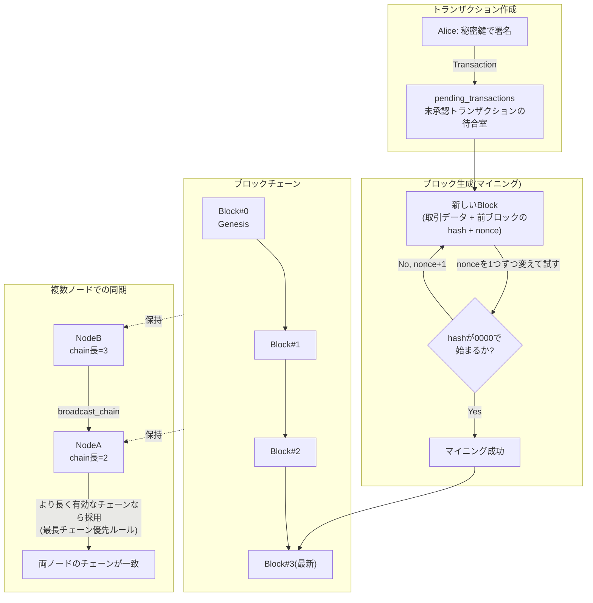

# 作業ログ（260702: 生成AI連携ブロックチェーン）

## 目的
生成AI（Gemini API）と連携するブロックチェーンプロダクトの実現に向け、
まずブロックチェーンの基本的な仕組みをスクラッチ実装で理解する。

## 方向性の検討
- 実装アプローチとして以下3案を比較検討し、フェーズ分けして進める方針に決定
  - A. 学習用に自作チェーンを実装
  - B. 既存チェーン（Ethereum/Solana等）上でスマートコントラクト開発
  - C. AIエージェントがチェーンを操作する自律エージェント基盤
- 金融分野（DeFi、証券のトークン化、クロスボーダー送金、パラメトリック保険等）と
  非金融分野（サプライチェーン、デジタルID、著作権管理、投票、医療データ、
  カーボンクレジット、ゲーム/メタバース）の応用事例を整理
- ゴール: 「フェーズ1で基礎を学ぶ → フェーズ3で生成AI APIと連携するプロダクトを作る」の3段階ロードマップに合意
  - フェーズ1: 自作ブロックチェーンで仕組みを理解する
  - フェーズ2: 既存チェーンへの橋渡し（スマートコントラクト入門）
  - フェーズ3: 生成AI API連携プロダクト（AIオラクル型を採用）
- 使用API: Gemini API（無料枠）
- ロードマップは [plan.md](plan.md) にまとめてpush済み

## フェーズ1: 自作ブロックチェーンの実装
[blockchain/](blockchain/) 配下にPythonでスクラッチ実装。

| ファイル | 役割 |
|---|---|
| [transaction.py](blockchain/transaction.py) | ECDSA(SECP256K1)による署名付きトランザクション |
| [block.py](blockchain/block.py) | ブロック構造とProof of Work(マイニング) |
| [blockchain.py](blockchain/blockchain.py) | チェーン管理、改ざん検証、最長チェーン優先ルール |
| [node.py](blockchain/node.py) | 複数ノード間の簡易P2P同期(同一プロセス内シミュレーション) |
| [demo.py](blockchain/demo.py) | 動作確認用デモスクリプト |

技術スタック: Python 3.12、`cryptography`パッケージ（ECDSA署名）

### システム構成図


```mermaid
flowchart TB
    subgraph Tx["トランザクション作成"]
        A1[Alice: 秘密鍵で署名] -->|Transaction| Pool[pending_transactions<br/>未承認トランザクションの待合室]
    end

    subgraph Mining["ブロック生成(マイニング)"]
        Pool --> Block["新しいBlock<br/>(取引データ + 前ブロックのhash + nonce)"]
        Block -->|nonceを1つずつ変えて試す| PoW{hashが0000で<br/>始まるか?}
        PoW -->|No, nonce+1| Block
        PoW -->|Yes| Mined[マイニング成功]
    end

    subgraph Chain["ブロックチェーン"]
        Genesis[Block#0<br/>Genesis] --> B1[Block#1] --> B2[Block#2] --> B3["Block#3(最新)"]
        Mined --> B3
    end

    subgraph P2P["複数ノードでの同期"]
        NodeA["NodeA<br/>chain長=2"]
        NodeB["NodeB<br/>chain長=3"]
        NodeB -->|broadcast_chain| NodeA
        NodeA -->|"より長く有効なチェーンなら採用<br/>(最長チェーン優先ルール)"| Sync[両ノードのチェーンが一致]
    end

    Chain -.保持.-> NodeA
    Chain -.保持.-> NodeB
```

- 左上「トランザクション作成」→中央「マイニング」→右「ブロックチェーンへの追加」という一方向の流れ
- 複数ノードがそれぞれ自分のチェーンを持ち、ブロードキャストと最長チェーン優先ルールによって全体の整合性が保たれる

### 実行方法
```bash
cd 260702/blockchain
python3 demo.py
```

### 実行結果
```
========== 1. マイニングと署名付きトランザクション ==========
署名検証(正常なトランザクション): True
署名検証(金額を改ざんしたトランザクション): False
ブロック#1をマイニング: hash=0000e77e1660b9a1... nonce=27939
チェーンの検証結果: True

========== 2. 改ざん検知 ==========
改ざん前のチェーン検証: True
ブロック#1のデータを直接書き換えた後の検証: False

========== 3. 複数ノードでのフォーク解消(最長チェーン優先) ==========
NodeA chain length: 2
NodeB chain length: 3
NodeBがブロードキャスト → 最長チェーン優先ルールでNodeAが追従
NodeA chain length: 3
NodeAとNodeBのチェーンが一致: True
```

### 結果の考察
1. **署名検証**: ECDSA署名により、送金額などトランザクション内容が1ビットでも
   書き換えられると検証が失敗する。本人の同意を得た内容以外は無効になることを確認。
2. **改ざん検知**: 各ブロックのハッシュは自身の内容(前ブロックのハッシュ・
   トランザクション・タイムスタンプ・nonce)から計算される。ブロック内容を
   直接書き換えるとハッシュの再計算値と一致しなくなり、チェーン全体が無効と
   判定される。これがブロックチェーンの改ざん耐性の核心。
3. **フォーク解消**: 複数ノードが同時にマイニングすると一時的にチェーンが
   分岐(フォーク)する。「より長く、かつ有効なチェーンを採用する」という
   最長チェーン優先ルールにより、ネットワーク全体が単一のチェーンに収束する
   ことを2ノード間のシミュレーションで確認した。
4. nonce値(採掘の試行回数)は実行のたびに変動する。これはハッシュ関数の
   性質上、条件を満たすnonceを事前に予測できず、総当たりで探索するしかない
   というPoWの特性そのものを表している。

## 専門用語のやさしい解説

**ハッシュ関数**
どんなデータを入れても、決まった長さの「指紋」のような文字列を返す計算。
同じ入力なら必ず同じ出力になるが、入力を1文字でも変えると出力は全く別物になる。
また、出力から元のデータを逆算することはできない。この性質を使って
「データが書き換えられていないか」を一瞬でチェックできる。

**ブロック / ブロックチェーン**
取引記録をまとめた「ページ」がブロック。各ページには前のページの指紋
（ハッシュ）が書き込まれており、ページ同士が鎖(チェーン)のようにつながっている。
途中のページを1ページでも書き換えると、それ以降の全ページの指紋が
合わなくなるため、改ざんがすぐバレる仕組みになっている。

**Proof of Work（PoW、マイニング）**
「ハッシュの先頭が0000で始まるような数字(nonce)を見つけろ」という、
答えを予測できない宝探しのようなクイズ。答えを見つけるには根気よく
数字を1つずつ変えて試すしかなく、時間と計算力がかかる。その代わり、
答えが正しいかどうかは一瞬で確認できる。これにより「簡単には偽物の
ブロックを大量生産できない」という仕組みを作り出している。マイニングを
行った人には報酬(コインバース)が支払われる。

**nonce（ノンス）**
PoWのクイズを解くために試行錯誤する「使い捨ての数字」。ハッシュ計算に
使うと出力が毎回変わる調整用のつまみのようなもの。答えが見つかるまで
0, 1, 2, ...と1つずつ増やして試す。

**ECDSA（楕円曲線デジタル署名アルゴリズム）**
「このデータは確かに自分が作った/同意した」ということを証明するための
デジタルサインの仕組み。手書きのサインと違い、他人が偽造することは
事実上不可能で、かつ誰でも「本物かどうか」を検証できる。
秘密鍵(自分だけが持つ)でサインを作り、公開鍵(誰でも見られる)で
そのサインが正しいかを確認する、鍵と鍵穴のような関係になっている。

**フォーク / 最長チェーン優先ルール**
複数の参加者がほぼ同時にブロックを見つけると、一時的にチェーンが
枝分かれ(フォーク)することがある。この時、「一番長く、かつルールに
沿って正しく作られたチェーン」を正式なものとして全員が採用する、
という多数決に似たルールで最終的に1本のチェーンに収束する。

## フェーズ2: 既存チェーンへの橋渡し(スマートコントラクト開発)
[hardhat/](hardhat/) 配下にHardhatプロジェクトとして実装。

| ファイル | 役割 |
|---|---|
| [hardhat.config.js](hardhat/hardhat.config.js) | Solidityコンパイラ・ネットワーク設定 |
| [contracts/PracticeToken.sol](hardhat/contracts/PracticeToken.sol) | OpenZeppelin実装によるERC-20トークン |
| [contracts/PracticeNFT.sol](hardhat/contracts/PracticeNFT.sol) | OpenZeppelin実装によるERC-721(NFT) |
| [test/](hardhat/test/) | 各コントラクトのMocha/Chaiテスト(8件) |
| [scripts/deploy.js](hardhat/scripts/deploy.js) | ローカルネットワークへのデプロイ・動作確認スクリプト |

技術スタック: Solidity 0.8.24、Hardhat 2、ethers.js、OpenZeppelin Contracts

当初 `npm install hardhat` で最新のHardhat 3が入ったが、対話シェル必須の初期化ウィザードと
ESM前提の新プラグイン体系(viemベース)のため学習用途には不向きと判断し、
定番構成であるHardhat 2 + ethers.jsに切り替えた。

### 実行方法
```bash
cd 260702/hardhat
npx hardhat compile
npx hardhat test
npx hardhat node &          # ローカルテストネットを起動
npx hardhat run scripts/deploy.js --network localhost
```

### 実行結果(テスト)
```
  PracticeNFT (ERC-721)
    ✔ mintするとtokenIdが0から連番で発行され、所有者が記録される
    ✔ owner以外はmintできない
    ✔ 各tokenIdは固有であり、ERC-20のように数量として混ざらない

  PracticeToken (ERC-20)
    ✔ デプロイ時にownerへ初期供給量が発行される
    ✔ 送金するとbalanceが正しく移動する
    ✔ 残高を超える送金は失敗する(フェーズ1の署名検証失敗に相当する安全装置)
    ✔ owner以外はmintできない
    ✔ ownerはmintできる

  8 passing
```

### 実行結果(ローカルテストネットへのデプロイ)
```
PracticeToken (ERC-20) デプロイ先: 0x5FbDB2315678afecb367f032d93F642f64180aa3
PracticeNFT (ERC-721) デプロイ先: 0xe7f1725E7734CE288F8367e1Bb143E90bb3F0512
ERC-20: 0xf39Fd6...92266 → 0x709979...c79C8 へ100 PRACを送金
alice残高: 100.0 PRAC
ERC-721: alice(0x709979...c79C8) へ tokenId=0 をmint
tokenId=0 の所有者: 0x709979...c79C8
```

### フェーズ1で学んだ概念との対応関係

| フェーズ1(自作実装) | フェーズ2(Ethereum/Hardhat) |
|---|---|
| `Transaction`クラス+ECDSA署名の自前検証 | `msg.sender`が呼び出し時に既に署名検証済みとしてコントラクトへ渡される。署名の生成・検証はネットワーク層(EOAの秘密鍵)が担い、コントラクトは検証済みの送信者を信頼してよい |
| `pending_transactions`(トランザクションプール) | Hardhat NetworkのmempoolがEIP-1559のガス代に基づき取引を保留・順序付けする(自作実装は単純なリストだったが、実チェーンではガス代の競争が入る) |
| `Block`のPoWマイニング(nonce総当たり) | Hardhat Networkは即時1取引=1ブロックで確定する開発用ネットワーク。実際のEthereum本番環境はPoWから2022年にPoS(Proof of Stake)へ移行済みで、バリデータの合意で確定する |
| `Blockchain.is_valid_chain()`によるハッシュチェーン検証 | EVM自体がブロックの整合性を保証するため、アプリケーション層(コントラクト)では意識不要。開発者は代わりに`revert`条件(残高不足・権限不足等)の設計に注力する |
| 最長チェーン優先ルールによるフォーク解消 | Hardhat Networkは単一ノードのシミュレーションのためフォークは発生しない。本番Ethereumではフォーク選択規則(PoS移行後はLMD-GHOST)が同様の役割を担う |
| 自前の「残高」概念なし(トランザクション履歴のみ) | ERC-20は`mapping(address => uint256) balances`で残高を直接管理する状態機械として実装されている点が、自作版(取引履歴の再生で残高を都度計算する発想に近い)との設計上の違い |
| トランザクションはすべて同じ形式(送金のみ) | ERC-721は同じ規格の中でも「各tokenIdが固有の所有者・メタデータを持つ」非代替性を型システムとコントラクトロジックで表現する |

### 結果の考察
1. OpenZeppelinの`Ownable`により、フェーズ1で自前実装していた「誰が操作を許可されるか」という
   検証ロジックを1行の`onlyOwner`修飾子に置き換えられた。標準化されたセキュアな実装を
   再利用できることが、実チェーン開発の大きな利点だと分かった。
2. ERC-20とERC-721はどちらも「所有権の移転」を扱う点は共通するが、前者は数量(残高)、
   後者は個別ID(所有者マップ)という全く異なるデータモデルで表現されている。
   同じ「トークン」という言葉でも設計思想が異なることを実装を通じて確認できた。
3. `mint`権限を持たないアカウントからの発行がカスタムエラー`OwnableUnauthorizedAccount`で
   確実に`revert`されることをテストで確認し、フェーズ1の署名検証失敗と同様に
   「不正な操作は台帳に反映されない」という保証がスマートコントラクトでも
   型・アクセス制御レベルで作り込まれていることを体感した。

## 次のステップ
- フェーズ3: Gemini APIを用いたAIオラクル型プロダクト(解析結果のハッシュ化とオンチェーン記録)に着手
