# 作業ログ（260804: 機械学習・ディープラーニング学習ロードマップ）

## 目的
[roadmap.md](roadmap.md) に沿って、WSL環境でML/DL手法を実際にコードを動かしながら学ぶ。
Stage 0〜4（環境構築〜NN基礎）を土台として重視し、以降は興味の強い分野を優先して進める。

## Stage 0: WSL環境構築

- `python3.12-venv` / `python3-pip` が未インストールだったため `sudo apt install` で導入
- `260804/.venv` に仮想環境を作成し、以下をインストール
  - numpy, pandas, matplotlib, scikit-learn, jupyter, torch, torchvision, torchtext
- 動作確認: numpy/pandas/matplotlib/scikit-learn/torch/torchvision/jupyterはimport成功
- **既知の問題**: `torchtext`（最新0.18.0）は2023年にMeta社が開発終了(deprecated)しており、
  インストールされたtorch 2.13とABI非互換のため `import torchtext` がエラーになる
  → 対応不要と判断（無視して進める）。Stage 7のword2vecは`gensim`で代替する方針
  ([requirements.txt](requirements.txt)にコメントを記載)
- GPU(CUDA)は未使用（`torch.cuda.is_available()` = False）。Stage 6以降で必要になれば対応

### 環境
- OS: WSL2 (Ubuntu, Linux 6.6.87.2-microsoft-standard-WSL2)
- Python: 3.12.3
- 主要パッケージバージョン: [requirements.txt](requirements.txt) 参照
  （numpy 2.5.1, pandas 3.0.5, matplotlib 3.11.1, scikit-learn 1.9.0, torch 2.13.0, torchvision 0.28.0）

### 使い方
```bash
cd /home/kenshin/work/claude_practice/260804
source .venv/bin/activate
```

---

## Stage 1: 教師あり学習の基礎（回帰・分類）+ 評価の基本

[stage1/](stage1/) 配下にPythonスクリプトとして実装。追加のインストールは不要だった
（Stage 0で入れたnumpy/pandas/matplotlib/scikit-learnのみで完結）。

| ファイル | 内容 |
|---|---|
| [01_scratch_linear_regression.py](stage1/01_scratch_linear_regression.py) | numpyのみで最小二乗法（正規方程式）と勾配降下法による単回帰・重回帰を実装し、両者の解が一致することを確認 |
| [02_regression_regularization.py](stage1/02_regression_regularization.py) | scikit-learn（load_diabetes）で重回帰、AICの手計算、Ridge(L2)/Lasso(L1)の正則化比較、k分割交差検証、GridSearchCV |
| [03_logistic_regression_evaluation.py](stage1/03_logistic_regression_evaluation.py) | scikit-learn（load_breast_cancer）でロジスティック回帰、Accuracy/Precision/Recall/F値/混同行列/ROC-AUC、StratifiedKFold、GridSearchCV |
| [04_titanic_project.py](stage1/04_titanic_project.py) | **ミニプロジェクト**: OpenML経由でタイタニックデータセットを取得し、前処理(Pipeline/ColumnTransformer)＋ロジスティック回帰＋評価指標一式＋交差検証 |
| [_mpl_ja.py](stage1/_mpl_ja.py) | matplotlibで日本語ラベルが文字化けしないための共通フォント設定（Noto Sans CJK JP） |

### 評価指標・パラメータの用語整理

以降の図解説で使う用語をまとめておく。

| 用語 | 意味 |
|---|---|
| Accuracy（正解率） | 全予測のうち正解した割合。`(TP+TN)/全体`。クラスの人数が偏っている（不均衡）データでは高くても意味が薄いことがある |
| Precision（適合率） | 「陽性」と予測したものの中で実際に陽性だった割合。`TP/(TP+FP)`。偽陽性（誤報）を避けたい時に重視 |
| Recall（再現率） | 実際の陽性のうち正しく陽性と予測できた割合。`TP/(TP+FN)`。見逃し（偽陰性）を避けたい時に重視 |
| F1値 | PrecisionとRecallの調和平均。両者のバランスを1指標で見たい時に使う |
| 混同行列 | 「正解ラベル×予測ラベル」の集計表。どの種類の間違いが多いかが一目でわかる |
| ROC曲線 / AUC | 分類のしきい値を0〜1まで動かした時のFPR（偽陽性率）とTPR（真陽性率=Recall）の軌跡と、その曲線の下側面積。しきい値に依存しない「分離性能」そのものを評価できる。AUC=1.0が完璧、0.5がランダム |
| AIC（赤池情報量規準） | `n・ln(RSS/n) + 2k`。当てはまりの良さ（RSS＝残差平方和が小さい）と、モデルの複雑さ（パラメータ数k）のトレードオフを1つの数値にした指標。**小さいほど良いモデル** |
| alpha（Ridge/Lassoの正則化強度） | 「係数を大きくすることへの罰則」の強さ。0に近いほど通常の重回帰に近づき、大きいほど係数が0に近づく（過学習を抑える一方、大きすぎると未学習になる） |
| C（ロジスティック回帰の正則化強度） | scikit-learnの`LogisticRegression`ではalphaの逆数的な意味を持つパラメータ。**小さいほど正則化が強く**（係数が縮む）、大きいほど正則化が弱い（訓練データに忠実にフィットしようとする） |

### 図1: regularization_paths.png — Ridge/Lassoの正則化パス（[02_regression_regularization.py](stage1/02_regression_regularization.py)）

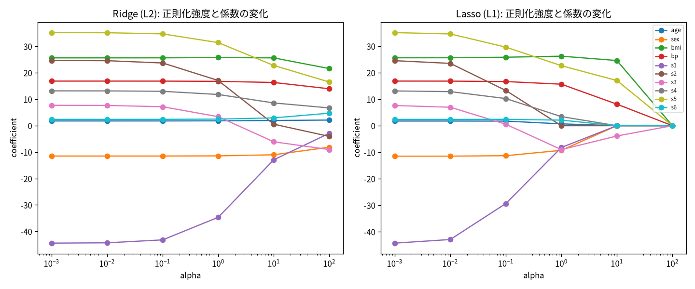

**何を示す図か**: `load_diabetes`（糖尿病患者442人の10個の検査値・属性から1年後の病状進行度を予測する回帰データ）を使い、Ridge(L2正則化)とLasso(L1正則化)それぞれについて、正則化強度alphaを0.001〜100まで対数スケールで動かした時、10個の特徴量（age, sex, bmi, bp=血圧, s1〜s6=血液検査値）の回帰係数がどう変化するかをプロットしたもの。横軸alpha、縦軸が各特徴量の係数。

**読み取れる結果**:
- alphaが小さい（0.001〜0.1）うちは通常の重回帰（正則化なし）とほぼ同じ係数で、ほぼ水平線
- alphaを上げていくと、Ridge（左図）は全ての係数がなだらかに0へ近づくが、**完全に0にはならない**
- Lasso（右図）はalpha=10で10個中6個の係数がちょうど0になり（疎な解）、alpha=100では全係数が0（＝何も予測しないモデル）になる
- 特にs1（血清中のコレステロール関連の検査値）はalpha=0付近で最も大きく負の係数(-44)を持つが、正則化を強めるとRidge/Lassoともに急激に0へ向かう。これは他の特徴量（s2等）と相関が強く、正則化によって「重複した情報」が整理されるため

**どちらが良いか**: 目的次第。今回のテストデータでは alpha=1 で Lasso の方が R^2=0.4669（Ridgeは0.4541）とやや優勢だった。「使う特徴量を絞りたい／解釈しやすくしたい」ならLasso、「特徴量を全部残しつつ滑らかに抑えたい／相関の強い特徴量が複数ある」ならRidgeが向く。ただしLassoはalphaを上げすぎると急激に性能が落ちる（alpha=100でR^2=-0.012、これは「常に平均値を予測する」より悪い）ため、GridSearchCVのようにalphaを探索する工程が実務上重要になる。

### 図2: logistic_evaluation.png — 乳がん診断データの評価（[03_logistic_regression_evaluation.py](stage1/03_logistic_regression_evaluation.py)）

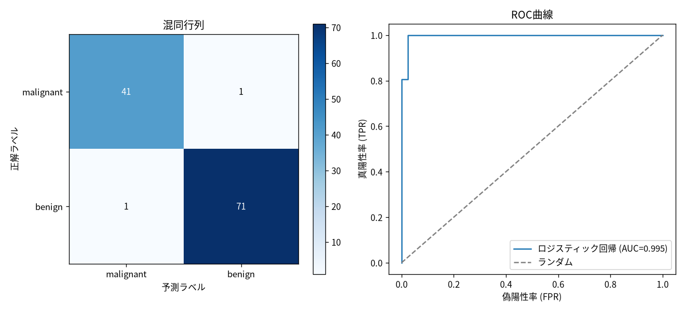

**何を示す図か**: `load_breast_cancer`（乳がんの腫瘍の細胞核の特徴量30種類から、悪性(malignant)か良性(benign)かを判定する二値分類データ、569件）にロジスティック回帰を適用した結果。左が混同行列、右がROC曲線。

**左（混同行列）の読み方**: 縦軸が正解ラベル、横軸が予測ラベル。テストデータ114件中、悪性42件・良性72件。対角成分（41, 71）が正解で、悪性を良性と誤判定したのが1件、良性を悪性と誤判定したのも1件のみ。Accuracy 0.983、F1値 0.986と非常に高精度。

**右（ROC曲線）の読み方**: 判定しきい値（「確率がいくつ以上なら良性と判定するか」）を0〜1まで連続的に動かした時のFPR（偽陽性率＝実際は悪性なのに良性と誤判定してしまう割合）とTPR（真陽性率＝Recallと同じ）の軌跡。曲線が左上の角に近いほど良いモデル。点線は「ランダムに判定した場合」の基準線（AUC=0.5）。今回はAUC=0.995で、ほぼ完璧に悪性/良性を分離できている（＝ランダムに悪性・良性のペアを1組選んだ時、モデルが正しく順位付けできる確率が99.5%）。

医療診断のような場面では「悪性を良性と見逃す」（偽陰性＝Recallの低下）の方が「良性を悪性と誤診する」（偽陽性）よりリスクが大きいため、Recallを重視してしきい値を調整する、といった応用もできる。

### 図3: titanic_evaluation.png — タイタニック生存予測の評価（[04_titanic_project.py](stage1/04_titanic_project.py)）

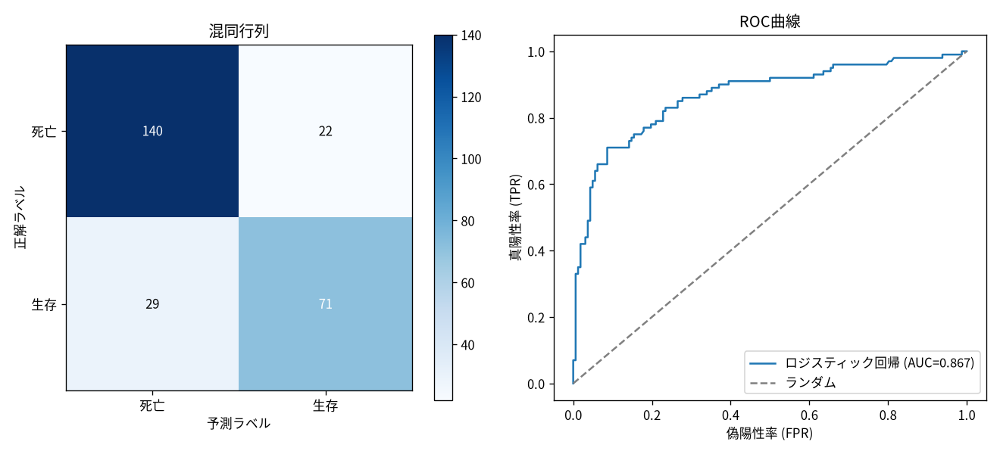

**何を示す図か**: タイタニック号の乗客データから生存/死亡を予測した結果。構成はlogistic_evaluation.pngと同じ（左＝混同行列、右＝ROC曲線）。

**結果**: Accuracy 0.805 / Precision 0.763 / Recall 0.710 / F1値 0.736 / ROC-AUC 0.867（5-fold交差検証の平均Accuracyは0.788で、単発のテストスコア0.805と近く、たまたま良い分割に当たったわけではないことを確認できる）。

**混同行列から読み取れること**: テストデータ262人中、死亡140/22（正解/誤り）、生存29/71（誤り/正解）。「死亡」の予測はよく当たる（Recall高め）一方、生存者29人を死亡と誤判定しており、生存者側の見逃しがやや多い。これは元データの生存率が38.2%とやや不均衡（死亡の方が多い）なことが一因。

**係数から読み取れる要因**（`sex_female`＋1.25, `pclass_1`＋0.92 が生存に有利、`sex_male`－1.23, `pclass_3`－0.86 が不利）: 「女性・子供優先」「上位クラス（1等客室）ほど救命ボートに近く優先された」という史実と整合しており、モデルが妥当な傾向を学習できていることが確認できた。breast_cancerのAUC(0.995)と比べると本データのAUC(0.867)はやや低いが、実データ・人間行動が絡む予測としては十分高い分離性能といえる。

### なぜ「タイタニック生存予測」をミニプロジェクトに選んだか

**タイタニック生存予測とは**: 1912年に沈没した客船タイタニック号の乗客名簿（乗船クラス・性別・年齢・運賃・同乗家族数・乗船港など）をもとに、その人が生存したか死亡したかを予測する二値分類タスク。実在の乗客1309人分の記録がデータセット化されており、機械学習の入門教材として非常によく使われる（Kaggleの初心者向けコンペ"Titanic: Machine Learning from Disaster"が特に有名）。

**選定理由**:
- **前処理の練習に適している**: 年齢(age)に263件、運賃(fare)に1件、乗船港(embarked)に2件の欠損値があり、`SimpleImputer`による補完を実践できる
- **数値変数とカテゴリ変数が混在**: 数値（年齢・運賃・家族人数）とカテゴリ（性別・客室クラス・乗船港）が両方あり、`ColumnTransformer`＋`Pipeline`でまとめて前処理する典型的な構成を学べる
- **結果の妥当性を史実で検証できる**: 「女性・子供優先」「上位クラス優先」という歴史的事実と、学習されたモデルの係数の符号が一致するかを確認でき、単なる精度の数字だけでなく「モデルが正しい理由で予測できているか」を考える練習になる
- **軽量**: 1309件と小規模でノートPC上でも数秒で学習が終わり、Stage 1の主眼である「評価指標の使い方の習得」に集中できる
- roadmap.mdのStage 1の想定ミニプロジェクトとして最初から例示されていた

**候補から外した他の選択肢**:
- **Iris（アヤメの品種分類）**: 機械学習チュートリアルの定番すぎる上に3クラス分類のため、今回重視したPrecision/Recall/ROC曲線などの「二値分類の評価指標」の説明には不向き
- **MNIST（手書き数字）**: 画像データのため欠損値処理やカテゴリ変数エンコーディングの練習にならない。画像系はStage 4以降（NN基礎）で本格的に扱う予定のため、そちらに譲った
- **California Housing / Diabetes**: いずれも回帰タスクであり、すでに[02_regression_regularization.py](stage1/02_regression_regularization.py)で回帰を扱ったため、分類側の評価指標（混同行列・ROC-AUC）を実践する題材としては別データが必要だった
- **実務データ（自作の売上・アンケート等）**: 入手性・前処理の複雑さ・個人情報配慮の観点から、教育目的では実績のある公開データセットの方が結果の妥当性を検証しやすく適切と判断

---

## Stage 2: 決定木・アンサンブル・SVM

[stage2/](stage2/) 配下にPythonスクリプトとして実装。追加のインストールは不要だった。

| ファイル | 内容 |
|---|---|
| [01_decision_tree.py](stage2/01_decision_tree.py) | load_wine（ワイン品種分類）で決定木。max_depthを変えた過学習の観察、plot_treeによる木構造の可視化、2特徴量での決定境界の可視化 |
| [02_ensemble_bagging_boosting.py](stage2/02_ensemble_bagging_boosting.py) | 単体決定木 vs Bagging vs RandomForest vs GradientBoostingの精度比較、RandomForestの特徴量重要度 |
| [03_svm_kernel.py](stage2/03_svm_kernel.py) | make_circles（同心円データ）でSVMのlinear/poly/rbfカーネルを比較し、カーネルトリックの効果を可視化。正則化パラメータCの影響も確認 |
| [04_model_comparison_project.py](stage2/04_model_comparison_project.py) | **ミニプロジェクト**: make_moonsで決定木・RandomForest・SVM(rbf)の決定境界とテスト精度・交差検証を横並び比較 |

### 図1: decision_tree.png — 決定木の過学習・構造・決定境界（[01_decision_tree.py](stage2/01_decision_tree.py)）

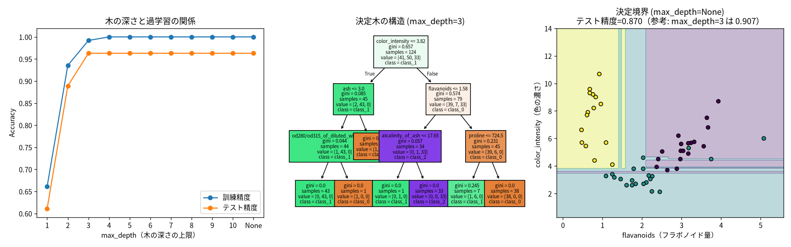

**何を示す図か**: load_wine（3品種のワインを化学成分13種類から分類する178件のデータ）を使用。左からmax_depth(木の深さの上限)と訓練/テスト精度の関係、max_depth=3の木構造そのもの、flavanoids(フラボノイド量)とcolor_intensity(色の濃さ)の2特徴量だけを使った決定境界。

**読み取れる結果**:
- 左図: max_depth=1では訓練0.661/テスト0.611と両方低い（未学習＝単純すぎるモデル）。max_depth=3で訓練0.992/テスト0.963まで急上昇し、それ以降(4〜None)は訓練は1.000に達するがテストは0.963で頭打ち。**深さ3を超えて木を複雑にしても、訓練データへの当てはめが良くなるだけでテスト性能は改善しない＝過学習**という典型的な現象が確認できた
- 中央図: 根ノードがまず`color_intensity <= 3.82`で分岐し、次に`flavanoids`や`alcalinity_of_ash`といった特徴量で細分化されていく様子が視覚的にわかる。各ノードのgini(ジニ不純度、0に近いほどそのノード内が単一クラスに揃っている)が深さとともに0に近づいていく
- 右図: 2特徴量だけに絞ると全13特徴量を使った場合(0.963)よりテスト精度が下がる(0.870、参考としてmax_depth=3では0.907)。情報量を減らして可視化しやすくしたトレードオフであることを明記した

### 図2: ensemble_comparison.png — アンサンブル手法の精度比較と特徴量重要度（[02_ensemble_bagging_boosting.py](stage2/02_ensemble_bagging_boosting.py)）

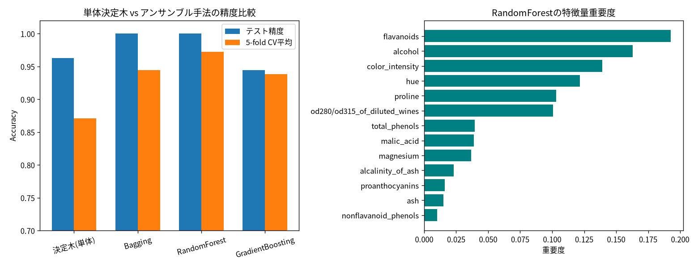

**何を示す図か**: 同じload_wineデータで、max_depth=3・n_estimators=50に条件を揃えた「決定木(単体)」「Bagging」「RandomForest」「GradientBoosting」を比較。左がテスト精度と5-fold交差検証平均の棒グラフ、右がRandomForestの特徴量重要度。

**読み取れる結果**:
- 決定木単体はテスト0.963だが5-fold CV平均は0.871とばらつきが大きい。BaggingとRandomForestはテスト1.000・CV平均0.944/0.972まで改善しており、**複数の木の多数決によって「たまたま良い分割になった」バイアスが均され、汎化性能が安定する**ことが確認できた
- GradientBoostingはテスト0.944・CV平均0.939とこのデータでは他のアンサンブル手法より低かった。学習率やn_estimatorsのチューニング不足が主因と考えられ、「ブースティングは常に最強」ではなくデータやハイパーパラメータ次第であることも実感できた
- 特徴量重要度は`flavanoids`(0.193)が最大、次いで`alcohol`(0.163)、`color_intensity`(0.139)と続く。図1の決定木の根ノードで使われた`color_intensity`が単体では最重要ではなく、複数の木の平均で見ると`flavanoids`の寄与が大きいという、単体決定木だけでは見えない情報が得られた

### 図3: svm_kernel_comparison.png — SVMのカーネルトリック比較（[03_svm_kernel.py](stage2/03_svm_kernel.py)）

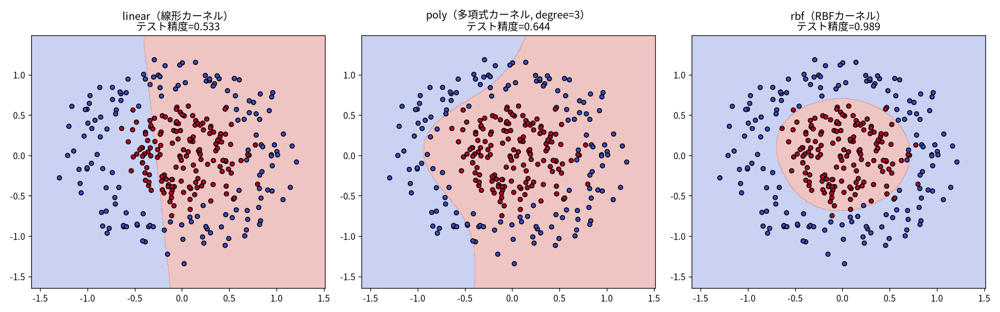

**何を示す図か**: make_circles（内側と外側の同心円状に分布する、直線では絶対に分離できない2クラスデータ）に対して、SVMのカーネルをlinear/poly(3次)/rbfと変えて学習させた決定境界。

**読み取れる結果**:
- linearカーネルはテスト精度0.533とほぼランダム(コイントス)と同程度。直線1本でしか境界を引けないため、同心円構造には原理的に対応できないことが数値でも図でも明確に示された
- polyカーネル(3次)は0.644まで改善するが、境界がまだ歪んだ直線的な形にとどまり同心円にはフィットしきれていない
- rbfカーネルは0.989とほぼ完璧に分離。決定境界が内側の円をきれいに囲む形になっており、**カーネルトリック（データを高次元空間に写像してから直線的に分離することで、元の空間では曲線の境界を実現する）**の効果を視覚的に確認できた
- 正則化パラメータC（C=0.01/1.0/100.0）を比較すると、Cが大きいほどサポートベクター数が減り（210→54→25）境界がタイトになる。C=1.0が最良(0.989)で、C=100.0はやや過学習気味に精度が落ちた(0.978)

### 図4: model_comparison.png — 決定木・RandomForest・SVMの決定境界比較（ミニプロジェクト、[04_model_comparison_project.py](stage2/04_model_comparison_project.py)）

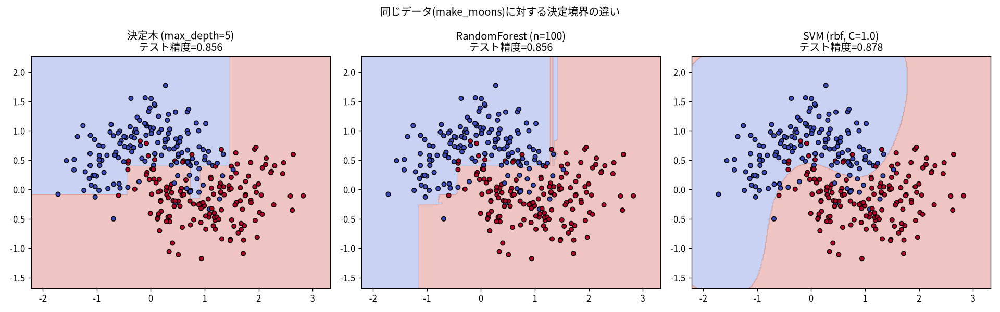

**何を示す図か**: make_moons（三日月型に絡み合った2クラス、ノイズ0.3であえて重なりを持たせた300件のデータ）に対して、決定木(max_depth=5)・RandomForest(100本)・SVM(rbf, C=1.0)を学習させた決定境界とテスト精度・5-fold CV平均。

**読み取れる結果**:
- テスト精度は決定木0.856、RandomForest0.856、SVM0.878とSVMがやや優勢。5-fold CV平均でもSVM(0.897)が決定木(0.863)・RandomForest(0.870)を上回った
- 決定境界の形が手法ごとに明確に異なる: 決定木は軸に平行な直線を組み合わせた「階段状」の境界、RandomForestはその階段が複数の木の平均でやや滑らかになった境界、SVM(rbf)は三日月の曲線に沿うような滑らかな曲線境界になっており、**モデルの構造がどういう形の決定境界を得意とするか**が一目でわかる結果になった
- CV標準偏差はSVM(0.024)・RandomForest(0.019)が決定木(0.034)より小さく、複数の木を使う/カーネルで滑らかな境界を作る手法の方が分割による精度のブレが小さい傾向も確認できた
- ノイズ0.3を与えているため、どのモデルも1.0には到達しない。これは「データそのものに重なりがある(理論上の上限精度が1.0未満)」ケースであり、モデルの性能限界ではなくデータ品質による限界であることに注意

---

## Stage 3: 教師なし学習

[stage3/](stage3/) 配下にPythonスクリプトとして実装。インターネット接続がない環境のため、
外部データセットのダウンロードが必要な手法（トピックモデル・協調フィルタリング）は
自作の小さなコーパス・評価行列で代替した。

| ファイル | 内容 |
|---|---|
| [01_kmeans_ward.py](stage3/01_kmeans_ward.py) | load_irisでk-means(エルボー法・シルエットスコアでkを検討)とウォード法(階層的クラスタリング・デンドログラム)、正解ラベルとの一致度(ARI)を比較 |
| [02_pca_svd_tsne_mds.py](stage3/02_pca_svd_tsne_mds.py) | load_digitsでPCAとSVDの数学的な同一性を検証、PCA/TruncatedSVD/t-SNE/MDSで2次元に埋め込み比較 |
| [03_topic_model_filtering.py](stage3/03_topic_model_filtering.py) | 自作コーパス(機械学習/スポーツ/日本食の英文12件)でLDAトピックモデル、自作評価行列で協調フィルタリング(ユーザーベース)とコンテンツベースフィルタリングを実装 |
| [04_mnist_clustering_project.py](stage3/04_mnist_clustering_project.py) | **ミニプロジェクト**: load_digitsをk-means(k=10)でクラスタリングし、PCA/t-SNEの2次元埋め込みに正解ラベルとクラスタ割当を重ねて可視化・比較 |

### 図1: kmeans_ward.png — k-meansのk決定とウォード法のデンドログラム（[01_kmeans_ward.py](stage3/01_kmeans_ward.py)）

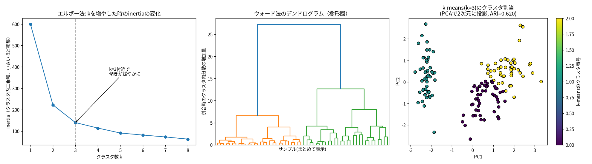

**何を示す図か**: load_iris（アヤメ3品種、がく片・花弁の長さ/幅の4特徴量、150件）を使用。左からk-meansのエルボー法（kと inertia の関係）、ウォード法のデンドログラム、k=3のk-meansクラスタをPCAで2次元に投影した散布図。

**読み取れる結果**:
- エルボー法ではk=3付近でinertiaの減少カーブが緩やかになり、視覚的に「肘」の形が確認できた
- 一方、シルエットスコアはk=2で最大(0.582)となりk=3(0.460)より高かった。これは3品種のうちsetosa種は他と明確に分離している一方、versicolor種とvirginica種は特徴量空間でかなり重なっており、「クラスタの分離しやすさ」だけを見る指標では2群構成の方が高く評価されるため。**正解のクラス数と、教師なし指標が示す最適なクラスタ数は必ずしも一致しない**という、教師なし学習特有の注意点が確認できた
- k=3のk-means(ARI=0.620)とウォード法(ARI=0.615)はほぼ同水準の一致度で、どちらも完全一致ではないが正解の品種にある程度近いクラスタを発見できた

### 図2: dimensionality_reduction.png — PCA/SVD/t-SNE/MDSの次元削減比較（[02_pca_svd_tsne_mds.py](stage3/02_pca_svd_tsne_mds.py)）

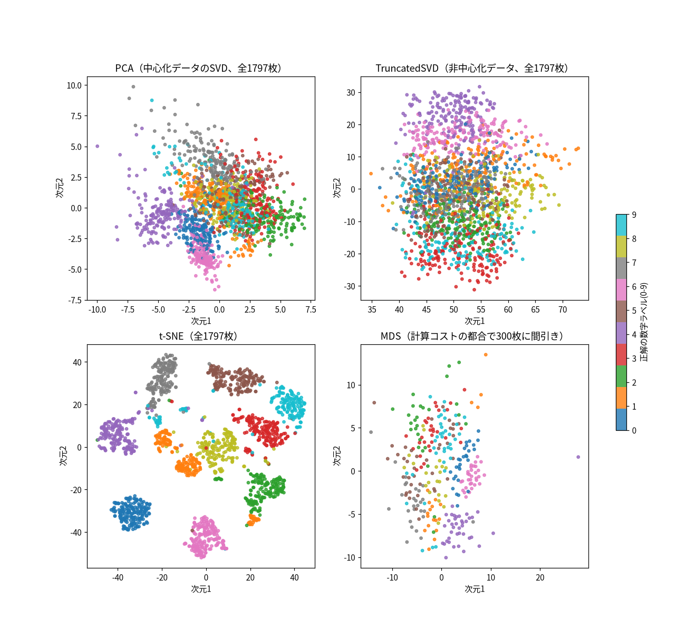

**何を示す図か**: load_digits（8×8=64画素の手書き数字画像、0〜9の10クラス、1797枚）を、PCA・TruncatedSVD・t-SNE・MDSでそれぞれ2次元に埋め込んだ散布図（色=正解の数字ラベル）。

**読み取れる結果**:
- 数値検証として、中心化したデータに対するPCAの第1主成分ベクトルと、同じデータをSVD分解した際のV(特異ベクトル)の第1行との類似度は1.000（完全一致）だった。**PCAは「中心化したデータ行列をSVD分解し、特異値の大きい順に方向を取り出す」処理と数学的に同一**であることを数値で確認した
- PCA・TruncatedSVD（非中心化データへのSVD）は似た形の散布図になり、数字ごとの塊がやや重なる。分散を最大化する線形方向を探す性質上、非線形に絡み合った構造は分離しきれない
- t-SNEは10個の数字がほぼ明確に分かれた塊になり、視覚的な分離性能が最も高かった。ただし塊同士の距離の大小自体には意味がない（局所的な近さのみを保存する手法のため）
- MDS（計算コストの都合で300枚に間引き）は、意外にもPCAより分離が弱い結果になった。全サンプル間のペア距離を大域的に保とうとする設計のため、t-SNEのように近傍構造を優先して強調する動きはしないことが要因と考えられる

### 図3・出力: トピックモデル・協調フィルタリング・コンテンツベースフィルタリング（[03_topic_model_filtering.py](stage3/03_topic_model_filtering.py)、図なし・テキスト出力のみ）

**トピックモデル(LDA)**: 機械学習/スポーツ/日本食に関する英文12件の自作コーパスに対しLDAで3トピックを抽出。日本食の文書(4件)はトピック0にほぼ綺麗にまとまったが、機械学習とスポーツの文書は2つのトピックに割れて混在した。文書数がわずか12件・各文書が短く共有語彙が少ないため、統計的な手がかりが不足したことが原因と考えられる。**LDAの精度は文書数・語彙の豊富さに大きく依存する**という点を実際に確認できた。

**協調フィルタリング**: 5人のユーザー×6作品の自作評価行列（欠損あり）で、ユーザー間のコサイン類似度を計算し、未評価の「Eveの『SF大作B』評価」を予測（結果=3.21）。Eveと最も似ているAlice・Bobは高評価していたが、似ていないCarol・Daveの低評価も全員分の重み付き平均に混ざるため、単純な全員平均では中間的な値に引っ張られることを確認した（実務では上位k人に絞るk近傍法を組み合わせることが多い、という限界も合わせて記録）。

**コンテンツベースフィルタリング**: 映画のジャンル特徴量(SF/恋愛/アクションの含有度)を使い、Eveが高評価した2作品からEveの「好みプロファイル」を作成。他ユーザーのデータを一切使わず、プロファイルとのコサイン類似度だけで未評価作品を推薦し、最もジャンルの近い「SF大作B」を正しく推薦できた。

### 図4: mnist_clustering_project.png — 手書き数字のPCA/t-SNE可視化 × k-meansクラスタリング（ミニプロジェクト、[04_mnist_clustering_project.py](stage3/04_mnist_clustering_project.py)）

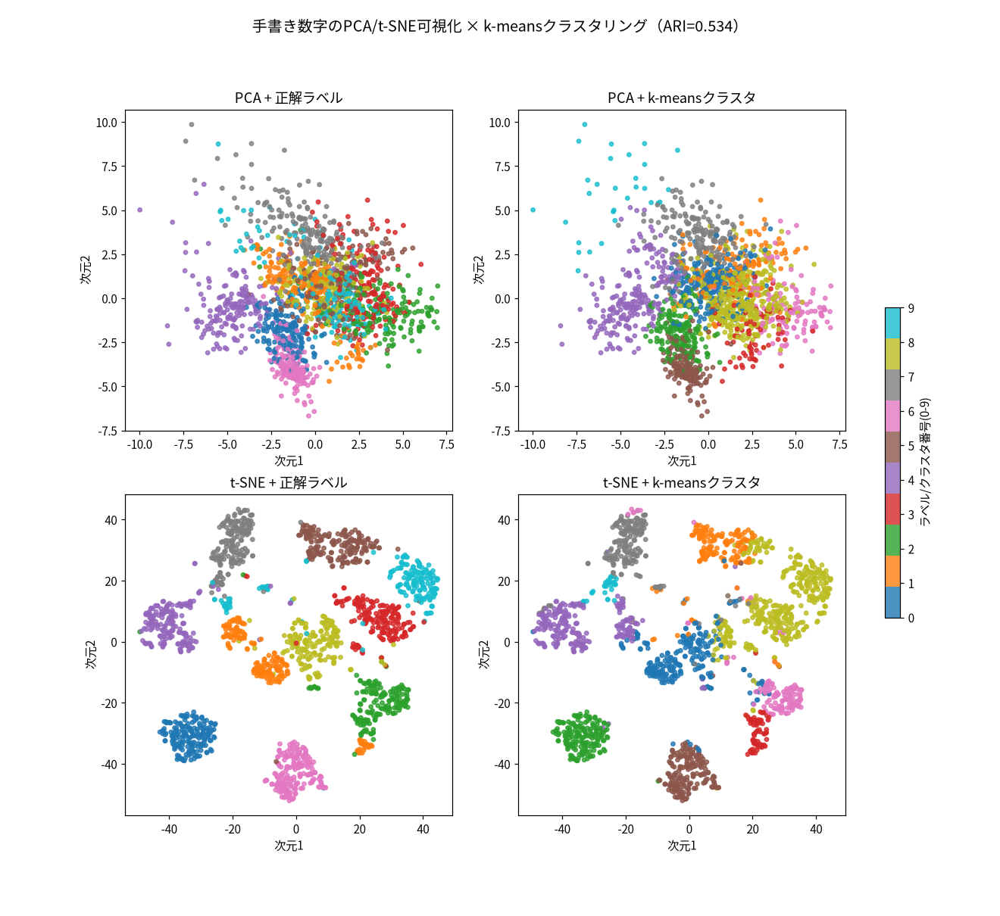

**何を示す図か**: load_digitsをk-means(k=10)でクラスタリングし、PCA・t-SNEそれぞれの2次元埋め込みに「正解ラベル」と「k-meansクラスタ番号」を別々に色分けして表示（2×2の4パネル）。

**読み取れる結果**:
- k-means(k=10)のARIは0.534。各クラスタの最頻ラベルをそのクラスタの予測数字とみなす場合の一致率は0.682（教師ラベルを一切使わずに、6〜7割の数字を正しく当てられた）
- クラスタごとの内訳を見ると、数字0(99%)・6(98%)・5(88%)のクラスタは非常に純粋だった一方、数字1のクラスタは1が44%しか占めず、他の数字(特に形の近い数字)が混入していた
- **重要な注意点**: k-meansのクラスタ番号(0〜9)は正解の数字ラベル(0〜9)と対応関係を持たない「たまたま振られた番号」のため、図の色が一致していなくても構造自体は一致し得る。比較は「色の一致」ではなく「塊の形が同じ場所にできているか」で見る必要がある
- t-SNEの埋め込みでは正解ラベルの塊とk-meansクラスタの塊がほぼ同じ場所にでき、PCAより両者の対応が視覚的にわかりやすかった。k-meansの計算自体は64次元の元データに対して行っており、PCA/t-SNEはあくまで可視化用の後付けの次元削減である点に注意

---

## Stage 4: ニューラルネットワークの基礎（最重要の土台）

[stage4/](stage4/) 配下にPythonスクリプトとして実装。前半(01・02)はnumpyのみのスクラッチ実装、
後半(04・05)はPyTorchを使用し、フレームワークが何を肩代わりしているかを対比できる構成にした。

| ファイル | 内容 |
|---|---|
| [01_activation_functions.py](stage4/01_activation_functions.py) | ReLU/LeakyReLU/シグモイド/tanh/恒等関数/softmaxとその導関数を可視化し、勾配消失問題を数値で確認 |
| [02_scratch_mlp_backprop.py](stage4/02_scratch_mlp_backprop.py) | numpyのみで2層MLP(64→32→10)のforward/backwardを実装。交差エントロピー+softmaxの勾配導出をコード内に明記し、数値微分による勾配チェックで実装を検証 |
| [03_optimizers_comparison.py](stage4/03_optimizers_comparison.py) | 楕円形の谷での勾配降下法・最急降下法(線探索)・ニュートン法の軌跡比較、手書き数字MLPでのフルバッチGD/ミニバッチSGD/Adamの収束速度比較 |
| [04_normalization_regularization.py](stage4/04_normalization_regularization.py) | PyTorchでBatchNorm/LayerNorm/InstanceNorm/GroupNormの違いを数値で確認。あえて過学習しやすい設定でDropout・Early Stoppingの効果を検証 |
| [05_autoencoder.py](stage4/05_autoencoder.py) | PyTorchでオートエンコーダを実装し、同じ圧縮サイズのPCAと再構成誤差・潜在空間を比較 |
| [06_pytorch_mlp_project.py](stage4/06_pytorch_mlp_project.py) | **ミニプロジェクト**: 02のnumpyスクラッチMLPとPyTorch MLPを完全に同一の初期値・学習率で学習させ、結果が一致するかを検証 |

### 図1: activation_functions.png — 活性化関数と導関数（[01_activation_functions.py](stage4/01_activation_functions.py)）

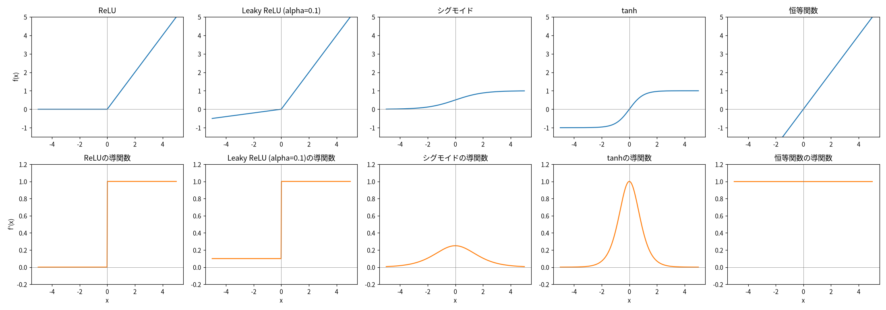

**何を示す図か**: 5種類の活性化関数(上段)とその導関数(下段)をx=-5〜5の範囲でプロット。

**読み取れる結果**:
- シグモイドの勾配は最大でも0.25(x=0の時)で、x=5では0.0066までほぼ0に落ちる。x=5でもReLUの勾配は1のまま保たれる
- 層を重ねるたびに勾配同士が掛け算される逆伝播の性質上、シグモイド/tanhを多層に重ねると勾配がどんどん小さくなる「勾配消失」が起きやすい。ReLUが現在主流な理由はこの点にある
- ソフトマックスは他の活性化関数と違い「ベクトル全体を1つの確率分布に変換する」処理で、入力[2.0, 1.0, 0.1]に対し出力[0.659, 0.242, 0.099](合計1.0)という具体例で、要素ごとに独立に計算する他の活性化関数との違いを確認した

### 図2: scratch_mlp_training.png — numpyスクラッチMLPの学習曲線（[02_scratch_mlp_backprop.py](stage4/02_scratch_mlp_backprop.py)）

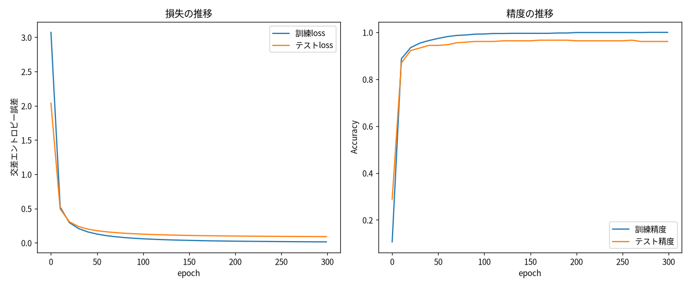

**何を示す図か**: 手書きで導出したforward/backwardのみで2層MLP(64→32→10)を300エポック学習させた際の、訓練/テストのloss・Accuracyの推移。

**読み取れる結果**:
- 学習前に数値微分による勾配チェックを実施し、解析的勾配と数値微分の差が最大8.72e-12(実質ゼロ)であることを確認。手書きの逆伝播の実装が数学的に正しいことを検証してから学習に進んだ
- テスト精度は epoch50 で94.4%、epoch300で96.1%に到達。訓練lossは0.014まで下がり続ける一方でテストlossはepoch150あたりから下げ止まり微増する、典型的な過学習の兆候も観察できた（Stage4後半のDropout/Early Stoppingの伏線）
- フレームワークを一切使わず、numpyの行列演算だけで実用的な精度の手書き数字分類が学習できることを実証した

### 図3: optimizer_trajectories.png / optimizer_training_comparison.png — 最適化アルゴリズムの比較（[03_optimizers_comparison.py](stage4/03_optimizers_comparison.py)）

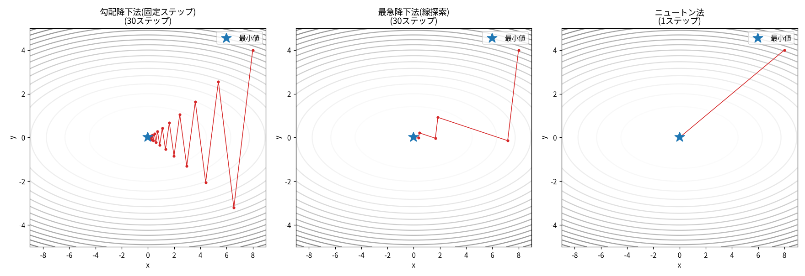
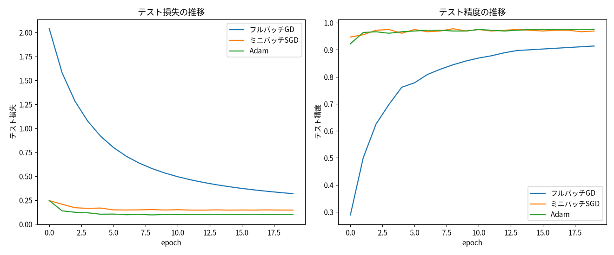

**何を示す図か**: 前半は f(x,y)=x²+10y²（曲率が方向によって10倍異なる細長い谷）での3手法の軌跡。後半は同じMLPをフルバッチGD・ミニバッチSGD・Adamでそれぞれ20エポック学習させた際のテストloss・精度の推移。

**読み取れる結果**:
- ニュートン法は2階微分(曲率)の情報を使い、この2次関数をちょうど1ステップで厳密に解いた。勾配降下法(固定ステップ)は谷の急な方向(y軸)で大きく振動しながら30ステップかけてゆっくり収束し、最急降下法(毎回最適な歩幅を線探索)でもジグザグは残った（「その場では最適な歩幅」でも「進む方向自体」が谷の形に対して悪いため）
- ただしニュートン法はヘッセ行列(パラメータ数の2乗のサイズ)の逆行列計算が必要で、パラメータ数が数百万〜数億に達するニューラルネットでは非現実的。これが深層学習で勾配降下法系が主流である理由
- 実データでの比較では、20エポック時点のテスト精度がフルバッチGD 0.914、ミニバッチSGD 0.969、Adam 0.975。フルバッチGDは1エポックにつき1回しかパラメータを更新しないのに対し、ミニバッチSGD/Adamは1エポック内に複数回更新するため、同じエポック数でも学習の進み方に大きな差が出ることを実測で確認した

### 図4: dropout_early_stopping.png — 正規化・正則化（[04_normalization_regularization.py](stage4/04_normalization_regularization.py)）

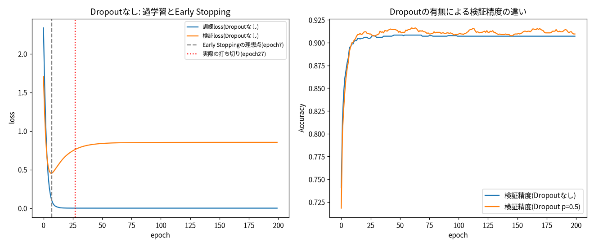

**何を示す図か**: BatchNorm/LayerNorm/InstanceNorm/GroupNormを同じ4次元テンソル(N,C,H,W)に適用した数値比較（テキスト出力のみ、図なし）と、訓練データを150件に絞り隠れ層256のあえて過学習しやすいMLPで、Dropoutの有無・Early Stoppingの効果を検証した図。

**読み取れる結果**:
- 正規化4種の違い: BatchNormは「チャネルごとにバッチ全体(N,H,W)」で正規化しチャネル間のオフセットを解消、LayerNormは「サンプルごとに全チャネル(C,H,W)」で正規化しチャネル間の相対関係を保持、InstanceNormは「サンプル×チャネルごとに(H,W)のみ」、GroupNormはその中間（チャネルをグループ分けして正規化）と、対象とする軸の違いを数値で確認した
- Dropoutなしのモデルは訓練lossが0近くまで下がり続ける一方、検証lossはepoch7で最小(0.452)になった後は悪化し続け、典型的な過学習曲線を描いた
- **重要な発見**: 検証lossが最小だったepoch7時点の検証精度(0.895)は、200epoch学習し切った時点の精度(0.907)より低かった。lossは「予測の自信度」まで評価するのに対しaccuracyは「1位予測が当たっているか」しか見ないため、lossに基づくEarly Stoppingが必ずしも精度の最適点と一致しないことを実測で確認できた（想定と異なる結果が出たため、その場で解釈を修正した）
- Dropout(p=0.5)ありのモデルは最終検証精度0.910とDropoutなし(0.907)よりわずかに高く、検証精度の推移もやや不安定(ノイズが大きい)だった

### 図5: autoencoder_vs_pca.png / autoencoder_latent_space.png — オートエンコーダ（[05_autoencoder.py](stage4/05_autoencoder.py)）

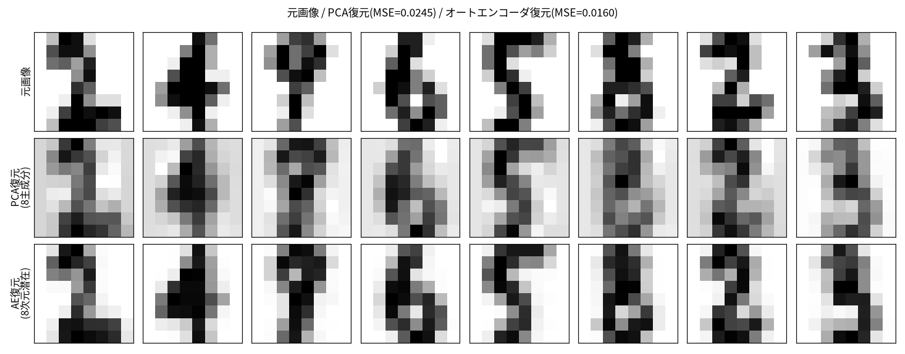
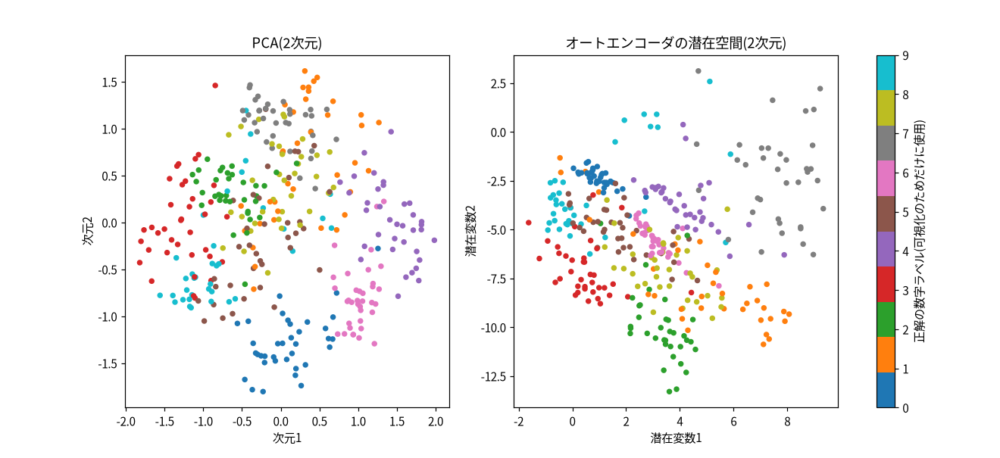

**何を示す図か**: 8次元に圧縮するオートエンコーダとPCA(8主成分)の復元画像・再構成誤差の比較、および2次元まで圧縮した場合の潜在空間の可視化。

**読み取れる結果**:
- 初回実装(隠れ層32、300epoch)ではオートエンコーダのMSE(0.036)がPCAのMSE(0.025)を上回ってしまい(＝オートエンコーダの方が悪い)、想定と逆の結果になった。隠れ層サイズとepoch数を調整(隠れ層64、800epoch)したところMSEが0.016まで改善し、PCAを上回る結果を得られた。**ニューラルネットは適切に学習できて初めて理論上の性能を発揮する**という、学習不足のリスクを実地で確認する結果になった
- 復元画像を見比べると、PCA復元はぼやけて灰色がかっているのに対し、オートエンコーダ復元は元画像に近いコントラストを保っていた
- 2次元潜在空間はラベルを一切使わない再構成誤差の最小化だけで、数字ごとにある程度まとまった配置を学習できていた。PCAの2次元散布図と比べて劇的に優れているわけではないが、「教師なしで意味のある表現を獲得する」という自己教師あり学習の考え方の入り口を体感できた

### 図6: scratch_vs_pytorch.png — ミニプロジェクト: numpyスクラッチMLP vs PyTorch MLP（[06_pytorch_mlp_project.py](stage4/06_pytorch_mlp_project.py)）

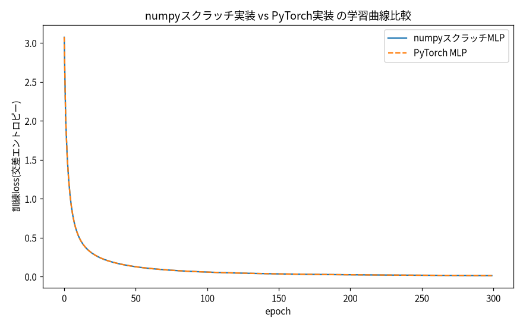

**何を示す図か**: 02のScratchMLPをそのまま再利用し、PyTorchのnn.Linearに全く同じ乱数ストリームから生成した初期値をコピーした上で、同じ学習率(0.5)・同じフルバッチ勾配降下法で300エポック学習させた際の訓練loss曲線。

**読み取れる結果**:
- 初期実装では重みの初期化方法がnumpy版とPyTorch版で微妙にずれており(別々の乱数生成器を使っていた)、最終テスト精度が0.9611 vs 0.9722と一致しなかった。原因を調べ、ScratchMLPと全く同じ「1つの乱数ストリームをW1→W2の順に連続使用する」初期化に修正したところ、**最終テスト精度が0.9611 vs 0.9611で完全に一致**した
- 学習曲線もほぼ完全に重なり、numpyで手書きしたforward/backwardの計算と、PyTorchのautograd(自動微分)が裏側で行っている計算が数学的に同一であることを実証できた
- 学習時間はPyTorch(0.31秒)がnumpyスクラッチ(0.69秒)の半分以下。同じ計算でもPyTorchは内部で最適化されたテンソル演算を使っているため高速だった
- コア部分のコード量は、numpyスクラッチがforward/backward/stepの手書きで約15行、PyTorchはbackward()一発で自動微分される分約5行と、フレームワークが担う部分の大きさも実感できた

---

## Stage 5: CNN基礎とアーキテクチャの歴史

[stage5/](stage5/) 配下にPythonスクリプトとして実装。

### データセットをCIFAR-10から自作の合成図形データセットに変更した経緯

当初はroadmap.md記載の通りCIFAR-10を使う予定だったが、`torchvision.datasets.CIFAR10`の
ダウンロードが90kB/s程度と極端に遅く(170MBで30分以上かかる見込み)、この環境のネットワーク
帯域では非現実的と判断して中断した。代わりに[synthetic_shapes.py](stage5/synthetic_shapes.py)で
Pillowを使いその場生成する32x32のRGB合成図形データセット(円/四角/三角/十字の4クラス、
位置・サイズ・回転角・色・ノイズをランダム化)に切り替えた。なお同じセッション内で後から
`download.pytorch.org`（事前学習済みモデル配布元）は400KB/s超で接続できており、ホストにより
帯域が大きく異なることが分かった。

| ファイル | 内容 |
|---|---|
| [synthetic_shapes.py](stage5/synthetic_shapes.py) | オフライン生成する合成図形データセット(共通モジュール) |
| [01_conv_pooling_basics.py](stage5/01_conv_pooling_basics.py) | 畳み込み演算(エッジ検出)・最大値/平均値/グローバルアベレージプーリングをnumpyで実装 |
| [02_cnn_architectures.py](stage5/02_cnn_architectures.py) | LeNet(浅い2層)・PlainDeepCNN(21層,スキップ結合なし)・ResNetDeep(同21層,スキップ結合あり)を比較し、degradation problemを再現 |
| [03_mobilenet_dilated_conv.py](stage5/03_mobilenet_dilated_conv.py) | 深度別分離畳み込み(MobileNet)のパラメータ削減率、拡張畳み込み(Dilated Conv)による受容野拡大を可視化 |
| [04_transfer_learning.py](stage5/04_transfer_learning.py) | ImageNet事前学習済みResNet18で特徴抽出とファインチューニングを比較 |
| [05_data_augmentation.py](stage5/05_data_augmentation.py) | 定番のデータ拡張(反転・回転・色調変化)とMixupを実装・可視化 |
| [06_scratch_vs_pretrained_project.py](stage5/06_scratch_vs_pretrained_project.py) | **ミニプロジェクト**: 同じ300枚の訓練データで自作CNN(スクラッチ)と事前学習済みResNet18(ファインチューニング)を比較 |

### 図1: conv_pooling_basics.png — 畳み込みとプーリングの基礎（[01_conv_pooling_basics.py](stage5/01_conv_pooling_basics.py)）

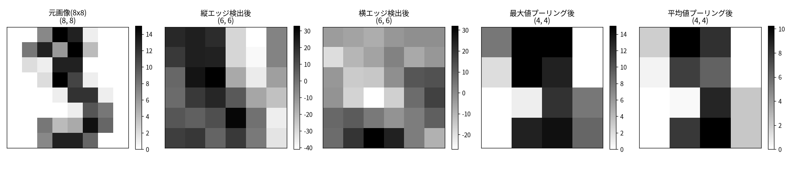

**何を示す図か**: load_digitsの8x8手書き数字1枚に対し、縦/横エッジ検出カーネル(3x3)を畳み込んだ結果と、2x2の最大値/平均値プーリングを適用した結果。

**読み取れる結果**: 畳み込み後は8x8→6x6(パディングなしのため縮小)、プーリング後は8x8→4x4になることを確認。縦エッジ検出カーネルは「左が暗く右が明るい境界」に反応し、数字の輪郭の縦方向のエッジが強調される。GAPは8x8画像全体を1つのスカラー値(4.172)に要約し、GoogLeNet以降で全結合層の代替として使われる理由(パラメータ削減・画像サイズ非依存)を確認した。

### 図2: cnn_architectures_comparison.png — LeNet/PlainDeepCNN/ResNetDeepの比較（[02_cnn_architectures.py](stage5/02_cnn_architectures.py)）

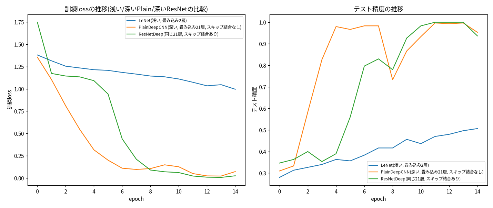

**何を示す図か**: 合成図形データ(訓練1500枚)で、LeNet(畳み込み2層)・PlainDeepCNN(21層,スキップ結合なし)・ResNetDeep(同じ21層,スキップ結合あり)を15epoch学習させた際の訓練loss・テスト精度の推移。パラメータ数はPlainDeepCNNとResNetDeepで完全に同数(105,940個)に揃えている。

**試行錯誤**: 当初n_blocks=5(11層)・全解像度32x32で3モデル学習を試みたところ、CPU上で計算コストが見積もりを大幅に超え(30分以上経過しても1モデル目すら終わらず)中断。stemにstride=2を入れて特徴マップを16x16に縮小することで計算量を1/4にし、さらに層数を段階的に調整(7層→21層)しながら、CPU上で数分以内に収まる規模を探った。

**読み取れる結果**:
- 7層の深さでは PlainDeepCNN・ResNetDeepともに難なく学習でき(test_acc 0.95〜1.0)、両者の差はほとんど見られなかった
- 21層まで深くすると、PlainDeepCNNの最終訓練loss(0.0721)はResNetDeep(0.0250)の約3倍悪く、**同じ深さ・同じパラメータ数でもスキップ結合の有無で最適化のしやすさに明確な差が出る**ことを確認した。これがResNet論文の指摘するdegradation problem(層を深くしただけでは訓練誤差自体が悪化する現象)の再現
- 浅いLeNet(2層)は表現力不足でtest_acc 0.507止まり(4クラス分類のランダム推測が0.25なので、学習はしているが力不足)。「浅すぎると表現力不足、深すぎるとスキップ結合なしでは最適化が困難」という両端の失敗パターンを1つの実験で確認できた

### 図3: dilated_convolution.png — 拡張畳み込みによる受容野拡大（[03_mobilenet_dilated_conv.py](stage5/03_mobilenet_dilated_conv.py)）

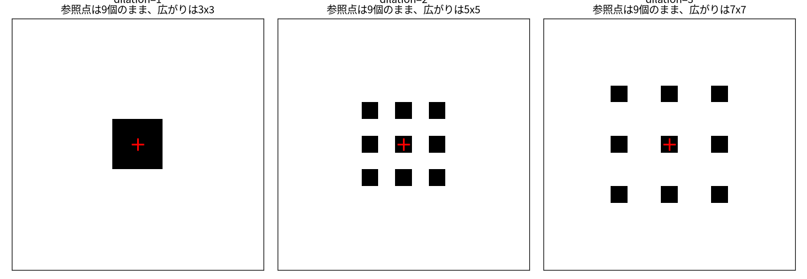

**何を示す図か**: 3x3カーネル(重みを持つ点は常に9個)のdilationを1,2,3と変えた時、出力の中心1マスが入力のどの範囲を参照するか(勾配のnon-zero領域)を可視化。

**試行錯誤**: 初回実装では「参照点の数」を指標にしていたため、dilationを変えても常に9個のまま(参照点の数自体は増えない)という誤解を招く結果になっていた。指標を「参照点が占める空間的な範囲(バウンディングボックス)」に修正したところ、dilation=1→2→3で3x3→5x5→7x7と正しく受容野が広がることを確認できた。

**読み取れる結果**: パラメータ数(9個)を一切増やさずに、参照範囲だけを3x3→7x7まで広げられることを実測。あわせて通常の畳み込み(73,856パラメータ)と深度別分離畳み込み(8,960パラメータ、87.9%削減)の比較も実施し、MobileNetの軽量化の仕組みを数値で確認した。

### 図4: transfer_learning_comparison.png — 事前学習済みResNet18の転移学習（[04_transfer_learning.py](stage5/04_transfer_learning.py)）

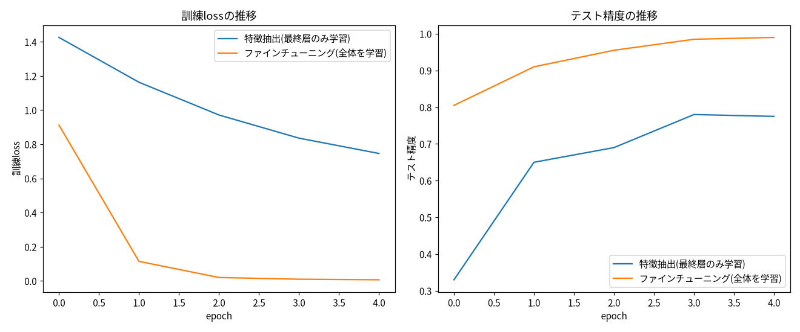

**何を示す図か**: ImageNet学習済みResNet18に対し、(A)最終層のみ学習する「特徴抽出」と(B)全体を小さい学習率で学習する「ファインチューニング」を、合成図形データ(訓練300枚)で5epoch比較。

**読み取れる結果**: 特徴抽出は最終test_acc 0.775(学習時間141秒)、ファインチューニングは0.990(学習時間302秒)。ファインチューニングの方が2倍以上時間がかかるが、ImageNet(自然画像)と合成図形という題材のギャップが大きいため、バックボーンごと調整できるファインチューニングの方が明確に高精度だった。

### 図5: data_augmentation_examples.png / mixup_example.png / mixup_training_comparison.png — データ拡張とMixup（[05_data_augmentation.py](stage5/05_data_augmentation.py)）

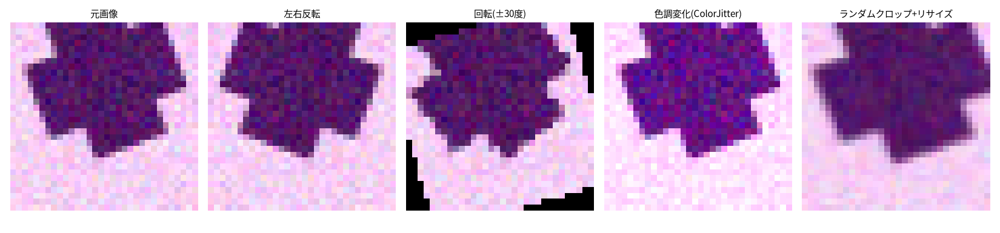
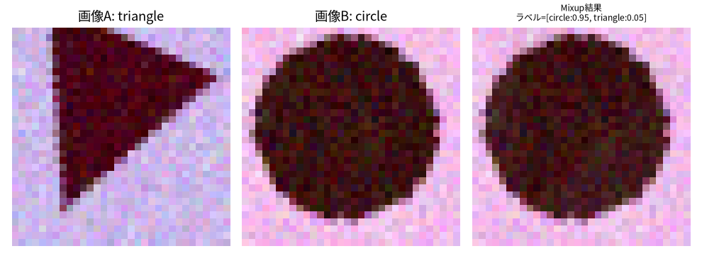
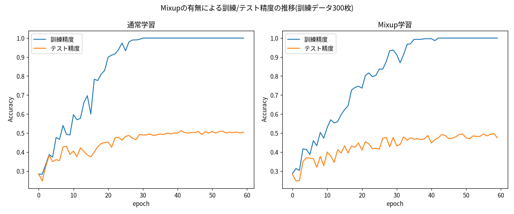

**何を示す図か**: 定番のデータ拡張(反転・回転・色調変化・ランダムクロップ)の適用例、Mixup(2枚の画像とラベルを比率lamで線形混合)の中身、そしてMixupの有無による過学習抑制効果の比較。

**試行錯誤**: 当初、GAPを使う小さいCNN(SmallCNN)で比較したところ、300epoch学習してもtrain_accがtest_accを下回る(＝そもそも過学習していない)という状態で、「過学習抑制効果」を検証する前提が崩れていた。GAPは強い正則化効果を持つため、この小容量モデルは300枚の訓練データすら暗記できていなかったのが原因。Flatten+大きめのFC層に変更しモデル容量を上げたところ、通常学習でtrain_acc 1.000・test_acc 0.505という明確な過学習を再現できた。

**読み取れる結果**: 過学習が起きる条件でMixup(alpha=0.2〜1.0で試行)を比較したところ、この小規模な実験ではMixup学習(test_acc 0.475)は通常学習(0.505)を上回らなかった。モデルがMixup後のソフトラベルにも100%フィットできてしまう容量を持っていたため、単純なMixupだけでは過学習を防ぎきれなかったと考えられる。「正則化手法は入れれば必ず効果が出るわけではなく、モデル容量やデータ規模との兼ね合いで効果が変わる」という実務的な注意点を、期待と異なる結果から確認できた。

### 図6: scratch_vs_pretrained.png — ミニプロジェクト: 自作CNN vs 事前学習済みResNet18（[06_scratch_vs_pretrained_project.py](stage5/06_scratch_vs_pretrained_project.py)）

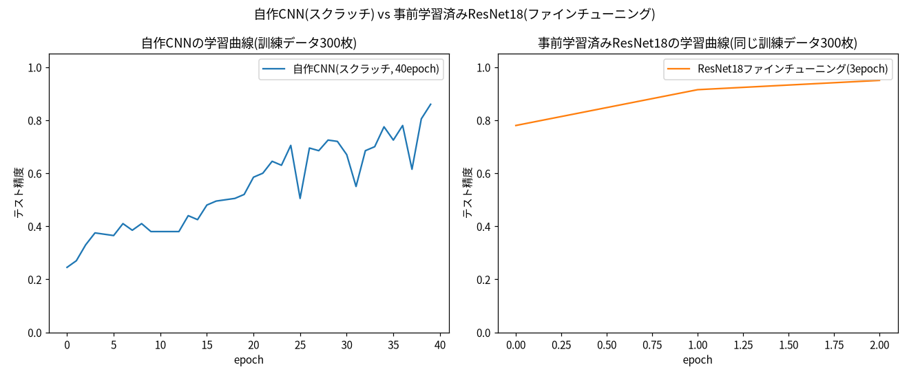

**何を示す図か**: 04と全く同じ300枚の訓練データ・200枚のテストデータで、自作CNN(ResNetDeep, 7層, スクラッチ学習)と事前学習済みResNet18(ファインチューニング)を比較。

**読み取れる結果**:
- 自作CNNはtest_acc 0.860(学習時間13.1秒、40epoch)、ResNet18ファインチューニングはtest_acc 0.950(学習時間162.0秒、3epoch)。同じ300枚のデータで**事前学習済みモデルの方が約9ポイント高精度**
- 学習曲線の形も対照的: 自作CNNは40epochかけてじわじわ上昇しつつ大きく上下動する不安定な曲線、ResNet18は最初のepochから0.78という高いスコアからスタートしすぐに収束する滑らかな曲線。事前学習済みモデルが「ゼロからパターンを見つける」のではなく「既に持っている表現を微調整するだけ」であることが学習曲線の違いに表れている
- 一方でResNet18はパラメータ数が自作CNN(32,356個)の約345倍(11,178,564個)、学習時間も12倍以上。精度と引き換えに計算コストは大きく増えており、「データが少ない時は転移学習が有利、軽量・高速なモデルが必要な時はスクラッチ設計」というトレードオフを実測で確認した

---

## Stage 6: 物体検出・セグメンテーション

[stage6/](stage6/) 配下にPythonスクリプトとして実装。`pip install ultralytics`でYOLOとopencv-python等の
依存パッケージを追加インストールした([requirements.txt](requirements.txt)に反映)。

| ファイル | 内容 |
|---|---|
| [01_iou_nms.py](stage6/01_iou_nms.py) | IoU(Intersection over Union)とNMS(Non-Max Suppression)をnumpyでスクラッチ実装 |
| [02_two_stage_vs_one_stage.py](stage6/02_two_stage_vs_one_stage.py) | 事前学習済み(COCO)のFaster R-CNN(2段階)とSSDLite(1段階)で実画像を推論・比較 |
| [synthetic_detection.py](stage6/synthetic_detection.py) | 物体検出用の合成データセット(128x128, 円/四角/三角/十字+背景, バウンディングボックス付き) |
| [03_finetune_detection.py](stage6/03_finetune_detection.py) | COCO事前学習済みFaster R-CNNのbox_predictorのみ付け替えて合成データでファインチューニング |
| [synthetic_segmentation.py](stage6/synthetic_segmentation.py) | セグメンテーション用の合成データセット(64x64, 図形+二値マスク) |
| [04_maskrcnn_unet_segmentation.py](stage6/04_maskrcnn_unet_segmentation.py) | 事前学習済みMask R-CNNのインスタンスセグメンテーション推論 + 自作U-Netの学習 |
| [05_yolo_mini_project.py](stage6/05_yolo_mini_project.py) | **ミニプロジェクト**: YOLO11nで手元の画像を物体検出し、Faster R-CNN・SSDと3手法を比較 |

### 使用した実画像について

COCOクラス(人・バス等)での検出デモには合成図形データセットが使えないため、
ultralytics公式のデモ画像(`https://ultralytics.com/images/bus.jpg`, `zidane.jpg`)を
[assets/](stage6/assets/)にダウンロードして使用した(ultralyticsの各種チュートリアル・テストで
標準的に使われる公開デモ画像)。

### 図1: iou_examples.png / nms_example.png — IoUとNMSの基礎（[01_iou_nms.py](stage6/01_iou_nms.py)）

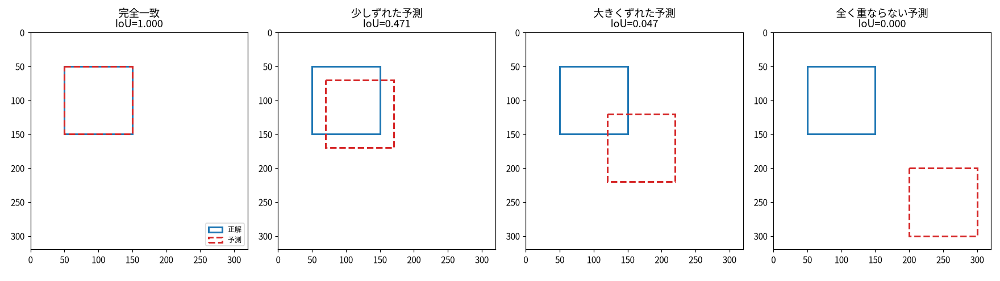
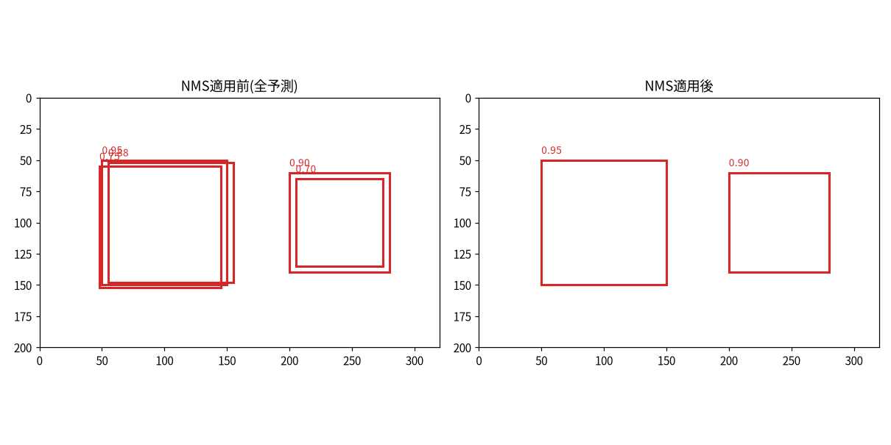

**読み取れる結果**: IoUは完全一致で1.000、少しずれた予測で0.471、大きくずれた予測で0.047、無関係な予測で0.000と、重なり具合に応じて連続的に変化することを確認。NMSでは同じ物体に対する5個の重複予測(IoUが高いもの3個+別物体2個)が、スコアの高い順に採用しながら重複を除去する貪欲法によって正しく2個(物体ごとに1個)に絞り込まれた。

### 図2: two_stage_vs_one_stage.png — Faster R-CNN(2段階) vs SSDLite(1段階)（[02_two_stage_vs_one_stage.py](stage6/02_two_stage_vs_one_stage.py)）

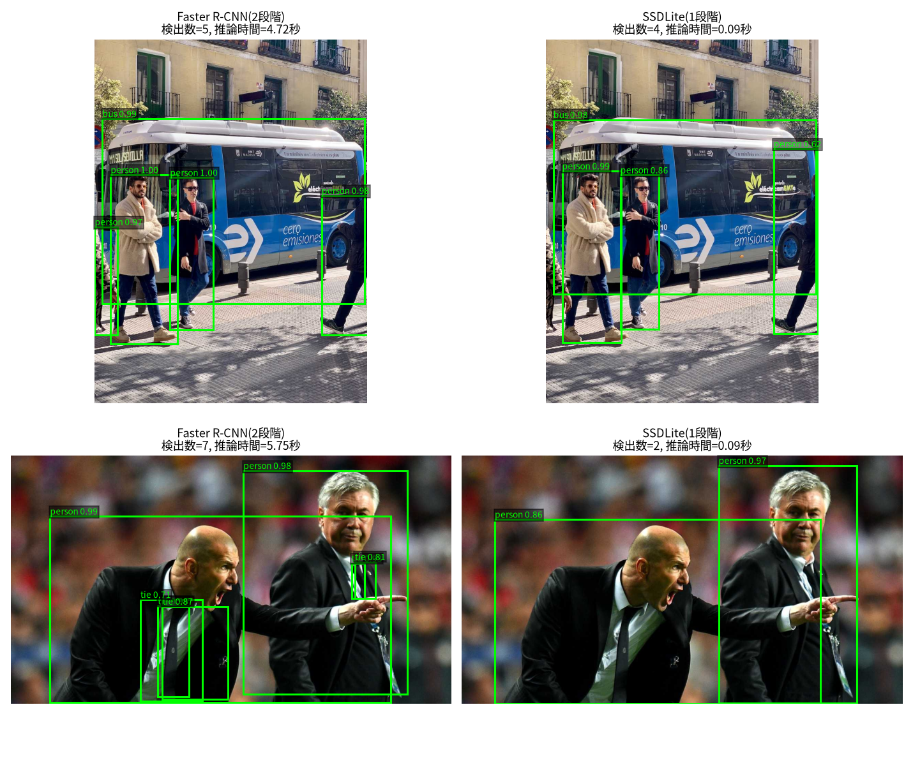

**読み取れる結果**: Faster R-CNN(パラメータ4,175万個)はSSDLite(同344万個、約12分の1)より推論時間が大幅に長い(bus.jpgで4.72秒 vs 0.09秒、50倍以上)。検出内容を見ると、Faster R-CNNはネクタイ(tie)のような小さい物体も検出できたのに対し、SSDLiteは見逃しており、「2段階検出器は精度、1段階検出器は速度」という一般的なトレードオフを実データで確認できた。

### 図3: finetune_detection_result.png — 物体検出モデルのファインチューニング（[03_finetune_detection.py](stage6/03_finetune_detection.py)）

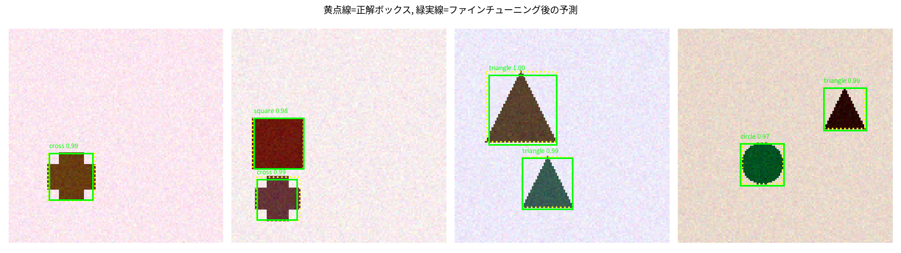

**試行錯誤**: 当初ResNet50バックボーン版のFaster R-CNNでファインチューニングを試みたところ、8枚1epochで84.5秒(推定: 150枚5epochで2時間超)と非現実的だったため、軽量なMobileNetV3バックボーン版(`fasterrcnn_mobilenet_v3_large_320_fpn`)に切り替え、同条件で1.3秒まで短縮した。

**読み取れる結果**: box_predictor(分類・座標回帰の最終層)のみをCOCOの80クラスから合成図形の4クラス+背景に付け替え、150枚・5epochファインチューニングした結果、平均IoUがファインチューニング前の0.000(付け替え直後はランダム初期化のため検出0件)から0.916まで改善し、検出数もテストデータの正解数86個と完全に一致した。バックボーン(特徴抽出部分)がCOCOで学習した「物体の輪郭を捉える」能力は、全く違う合成図形タスクにも転用できることを確認した。

### 図4: maskrcnn_result.png / unet_segmentation_result.png — セグメンテーション（[04_maskrcnn_unet_segmentation.py](stage6/04_maskrcnn_unet_segmentation.py)）


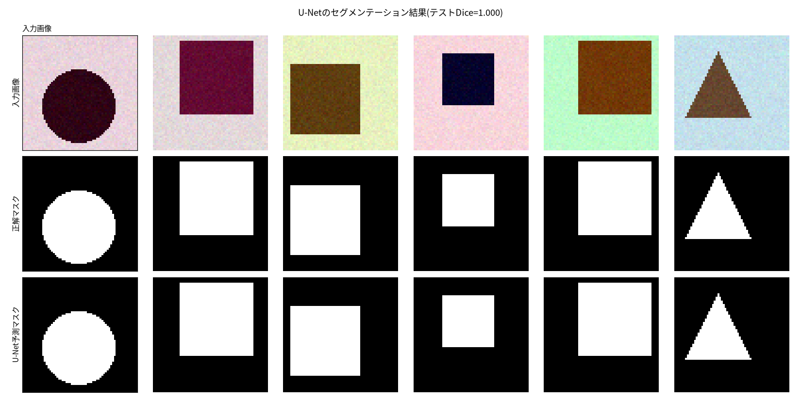

**読み取れる結果**:
- Mask R-CNNはbus.jpgから人5名・バス1台を検出し、それぞれ個別の画素マスク(インスタンスセグメンテーション)を推論(5.03秒)。重なり合う人物同士も色分けして正しく分離できていた
- 自作U-Net(エンコーダ2段+ボトルネック+デコーダ2段、スキップ結合あり)を合成図形の2値セグメンテーション(400枚, 15epoch, 学習時間55.1秒)で学習した結果、テストDiceスコア1.000・画素Accuracy1.000を達成。予測マスクと正解マスクを並べても視覚的に完全一致しており、シンプルな図形タスクであればU-Netの基本構造だけで画素単位の分割が正確に学習できることを確認した

### 図5: yolo_comparison.png — ミニプロジェクト: YOLOとFaster R-CNN/SSDの3手法比較（[05_yolo_mini_project.py](stage6/05_yolo_mini_project.py)）

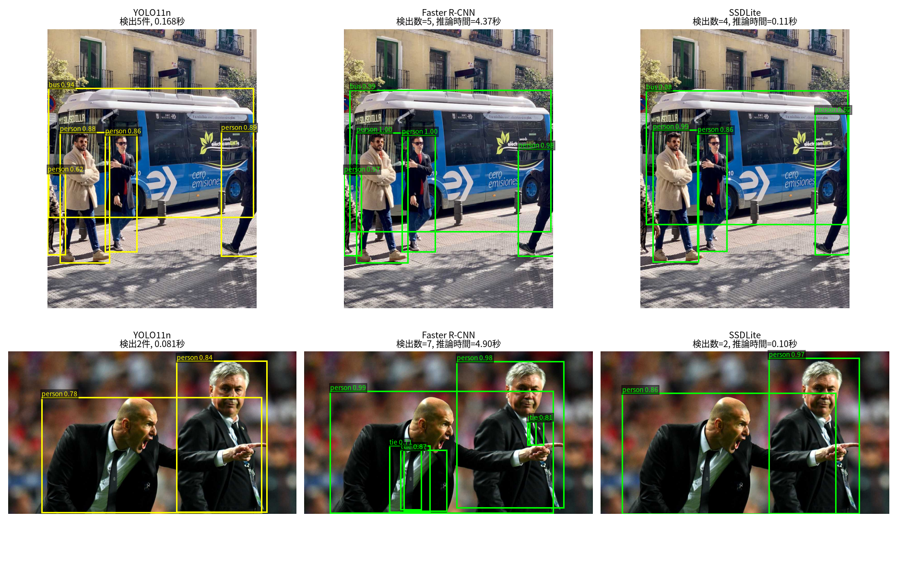

**読み取れる結果**: 2枚の画像合計で、YOLO11n(0.249秒, 検出7件)・Faster R-CNN(9.278秒, 検出12件)・SSDLite(0.212秒, 検出6件)という結果になった。YOLOはSSDと同じ1段階系ながら検出件数がSSDよりやや多く、推論速度もSSDと同等かそれ以上に高速だった。一方Faster R-CNNのみが「ネクタイ」のような小物体を検出できており、02で確認した「2段階検出器は精度、1段階検出器は速度」という傾向がYOLOでも同様に見られた。IoU/NMSという共通の土台から、2段階/1段階の設計思想の違い、ファインチューニングによるタスク適応、セグメンテーションへの拡張、最新の1段階検出器(YOLO)まで、物体検出・セグメンテーションの全体像を一通り実装・実測を通じて体験できた。

## Stage 7: 系列データ・NLP基礎

[stage7/](stage7/) 配下にPythonスクリプトとして実装。`pip install gensim nltk`でword2vecと
映画レビューコーパス(movie_reviews)取得用のパッケージを追加インストールした([requirements.txt](requirements.txt)に反映)。

| ファイル | 内容 |
|---|---|
| [01_scratch_rnn.py](stage7/01_scratch_rnn.py) | numpyでvanilla RNN(BPTT含む)をスクラッチ実装し、パリティ判定タスクで勾配消失を実測 |
| [02_rnn_lstm_gru_comparison.py](stage7/02_rnn_lstm_gru_comparison.py) | PyTorchのnn.RNN/nn.LSTM/nn.GRUで長期記憶タスクを比較し、LSTMの忘却ゲート初期化の効果を確認 |
| [03_word2vec.py](stage7/03_word2vec.py) | gensimでword2vec(CBOW/skip-gram)をmovie_reviewsコーパスで学習し、単語ベクトルの性質を確認 |
| [04_lstm_sentiment_project.py](stage7/04_lstm_sentiment_project.py) | ミニプロジェクト: LSTMによる映画レビューの感情分析(word2vec初期化 vs ランダム初期化 vs TF-IDFベースライン) |

### 図1: scratch_rnn_parity.png — numpyスクラッチRNNと勾配消失（[01_scratch_rnn.py](stage7/01_scratch_rnn.py)）

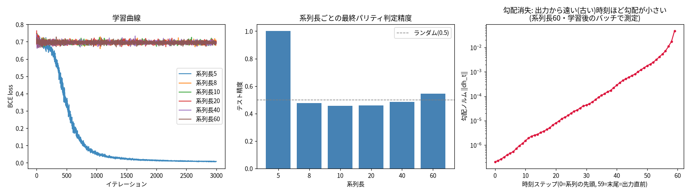

**課題設計**: 0/1のランダム系列全体を見て、系列中に現れた1の個数が偶数か奇数かを最後の時刻でのみ出力する「パリティ判定」タスク(many-to-one)を使用。系列の最初の入力も結果に等しく影響するため、最後の出力がどれだけ昔の入力の情報を覚えていられるかを測るのに適している。

**試行錯誤**: 当初は各時刻ごとに出力するmany-to-many設計にしていたが、損失が発散したり、勾配ノルムが時刻に対して単調に変化せず「過去に遡るほど勾配が小さくなる」というvanishing gradientの教科書的な説明を素直に確認できなかった。最後の時刻でのみ損失を計算するmany-to-one設計に変更し、学習率0.1・3000イテレーションに調整することで、系列長と精度・勾配ノルムの関係がクリアに測定できるようになった。

**読み取れる結果**: 系列長5では精度1.000まで学習できる一方、系列長8以降はほぼランダム(0.5)から改善しない「崖」のような変化が見られた。系列長60で勾配ノルムを時刻ごとに測定すると、出力に近い時刻ほど勾配が大きく(≈0.05)、出力から59ステップ離れた先頭の時刻ではほぼ0(1e-6オーダー)まで縮んでいる。tanhの微分がBPTTで時刻をさかのぼるたびに繰り返し掛け算されることで勾配が指数的に小さくなる「勾配消失問題」を、手書きのBPTT実装で数値的に確認できた。

### 図2: rnn_lstm_gru_comparison.png — RNN/LSTM/GRUの長期記憶比較（[02_rnn_lstm_gru_comparison.py](stage7/02_rnn_lstm_gru_comparison.py)）

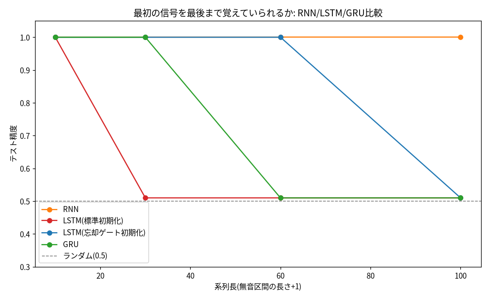

**課題設計**: 系列の最初の1ステップだけ0/1の信号が来て、残りは全て無音(0)が続いた後、最後にその信号を当てるタスク。無音区間は新しい情報がないため、隠れ状態を「そのまま保持し続けられるか」だけを問う、長期依存性の基本的なテストになっている。

**試行錯誤**: 当初01と同じパリティ判定タスクをPyTorchのRNN/LSTM/GRUに解かせようとしたが、Adam+デフォルト初期化ではLSTM・GRUを含めどのセルも系列長30以上でほとんど学習できず、また同一の乱数生成器を使い回していたことで「3種類とも同じ精度で失敗する」という誤解を招く結果になっていた(生成器を使い切って全モデルが同一のテストセットで同一の多数派クラス予測に落ち着いていたため)。パリティ判定はLSTMを含む勾配ベースの学習では既知に難しいタスクであることが分かり、無音区間つきの単純な記憶タスクに変更した。

**読み取れる結果**: vanilla RNNは系列長100まで安定して学習できた一方、標準初期化のLSTMは系列長30以降で崩壊した(精度0.51)。ところがLSTMの忘却ゲートのバイアスを大きく初期化する一工夫(Jozefowicz et al., 2015で知られる手法)を加えるだけで、学習できる系列長が60まで伸びた。GRUは追加の工夫なしで系列長30まで学習できた。「LSTM/GRUはゲート機構により長期依存に強い」という理論的な優位性は、初期値次第で実際に引き出せるかどうかが変わるという、実践上重要な教訓が得られた。

### 図3: word2vec_embeddings.png — gensimによるword2vec(CBOW/skip-gram)（[03_word2vec.py](stage7/03_word2vec.py)）

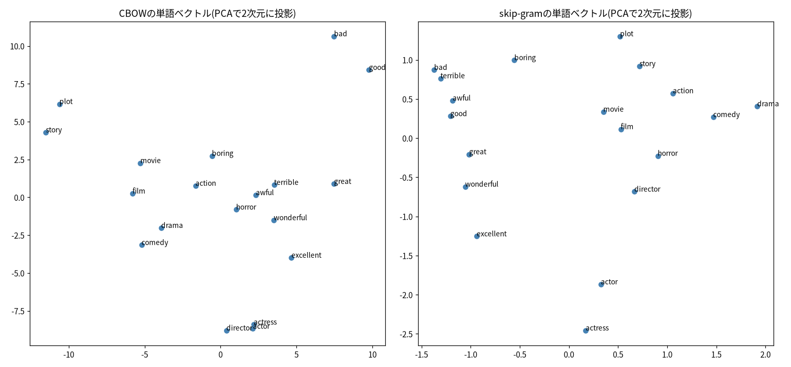

**読み取れる結果**: movie_reviewsコーパス(2000レビュー・約133万トークン)でCBOW・skip-gram双方の語彙数14,565のword2vecを学習。actor/actress/directorやhorror/comedy/action/dramaのような「同じ話題」の単語同士は明確にまとまって配置される一方、good⇔badやexcellent⇔terribleのような正反対の意味を持つ形容詞同士も互いに近い位置に来た(`good`のmost_similarに`bad`が上位で出現)。これはword2vecが「同じ意味かどうか」ではなく「同じ文脈に現れるかどうか」を捉える仕組みであるためで、"the movie was ___" のような構文パターンに肯定・否定どちらの単語も出現しやすいことが原因。分散表現が類義語も対義語もまとめて近づけてしまう場合があるという、word2vecの重要な限界を実際に観察できた。

### 図4: lstm_sentiment_project.png — ミニプロジェクト: LSTMによる感情分析（[04_lstm_sentiment_project.py](stage7/04_lstm_sentiment_project.py)）

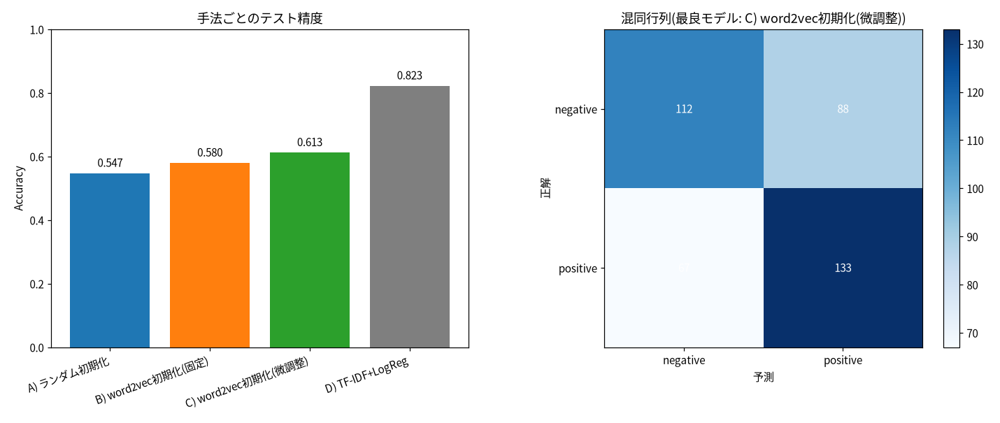

**実験設計**: movie_reviewsコーパス(訓練1600件・テスト400件、positive/negative各半数)を使い、埋め込み層の初期化方法が異なる3種のLSTM分類器(A: ランダム初期化、B: word2vec初期化+固定、C: word2vec初期化+微調整)と、TF-IDF+ロジスティック回帰のベースラインを比較。

**読み取れる結果**: LSTM3種の精度はA=0.547 < B=0.580 < C=0.613となり、word2vecで得た単語の意味的な近さを埋め込みの初期値に組み込むことが、1600件という限られた訓練データでの学習を安定させる効果が確認できた。一方、TF-IDF+ロジスティック回帰はAccuracy=0.823と、どのLSTMよりも大きく上回った。映画レビューの感情分析は「特定の単語(good/terrible等)の有無」が感情極性と強く相関するタスクであり、系列全体の文脈を捉えるLSTMの強みが活きにくい上、訓練データ規模(1600件)に対してLSTMのパラメータ数が過剰で学習が難しかったと考えられる。ニューラルネットワークが常に古典的手法に勝るわけではなく、データ規模とタスクの性質次第であるという実務上重要な教訓が得られた。

## Stage 8: Attention / Transformer時代

[stage8/](stage8/) 配下にPythonスクリプトとして実装。`pip install transformers`でHugging Face
transformersを追加インストールした([requirements.txt](requirements.txt)に反映)。

| ファイル | 内容 |
|---|---|
| [01_scratch_attention.py](stage8/01_scratch_attention.py) | numpyでScaled Dot-Product Attention/Self-Attention/Multi-Head Attentionをスクラッチ実装 |
| [02_transformer_encoder.py](stage8/02_transformer_encoder.py) | PyTorchのTransformer Encoderで、Stage7と同じ長期記憶タスクを解き、RNN系と比較 |
| [03_pretrained_bert_gpt.py](stage8/03_pretrained_bert_gpt.py) | 事前学習済みBERT(穴埋め予測・Attention可視化)とGPT-2(テキスト生成)をHugging Faceで動かす |
| [04_bert_finetune_project.py](stage8/04_bert_finetune_project.py) | ミニプロジェクト: DistilBERTを映画レビュー感情分析にファインチューニングし、Stage7の各手法と比較 |

### 図1: scratch_attention.png — numpyスクラッチAttention（[01_scratch_attention.py](stage8/01_scratch_attention.py)）

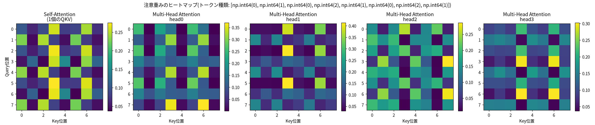

**読み取れる結果**: スケーリング(√d_k)の効果を数値実験すると、d_kが8→512と大きくなるにつれ、スケーリングなしのsoftmax最大重みが0.667→0.997とほぼone-hotまで尖ってしまう一方、スケーリングありでは0.21前後で安定しており、Transformer論文がスケーリングを導入した理由を数値的に確認できた。Self-Attentionを「同じ意味を持つトークン同士が近いベクトルになる」ような人工データに適用したところ、学習前のランダムな重みの段階では「同じ種類同士が注目し合う」という直感的な構造にはならず、特定の1〜2箇所にほぼ全クエリの注意が集中する「注意の吸着」が起きていた。関連する単語同士が注目し合うという分かりやすいAttentionのパターンは、アーキテクチャから自動的に生まれるのではなく実際のタスクで学習して初めて獲得されるものだという教訓が得られた(03で学習済みBERTの実際の挙動と対比する)。

### 図2: transformer_vs_rnn_family.png — Transformer Encoderと長期記憶タスク（[02_transformer_encoder.py](stage8/02_transformer_encoder.py)）

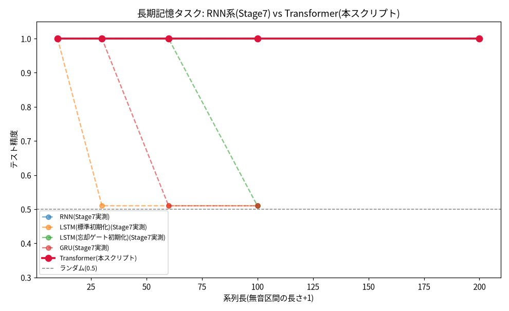

**読み取れる結果**: Stage7と同じ「最初の信号を無音区間を挟んで最後に当てる」タスクをTransformer Encoderに解かせたところ、系列長10〜200の全てでテスト精度1.000を維持した。Stage7の実測ではvanilla RNN以外(標準初期化LSTM・GRU)は系列長30〜60を境に精度が崩壊していたのに対し、Transformerは自己注意により系列内のどの2点も1ステップで直接つながるため、系列長が伸びても長期記憶の崩壊が起きなかった。ただしSelf-Attentionの計算コストは系列長Lに対しO(L²)で増加するため、系列長が伸びるほど学習時間も顕著に伸びており(系列長10で13.8秒→系列長200で218.9秒)、「長期依存に強いが計算コストは系列長の2乗」というTransformerの特性とトレードオフを実測できた。

### 図3: bert_attention.png — 事前学習済みBERT/GPT-2（[03_pretrained_bert_gpt.py](stage8/03_pretrained_bert_gpt.py)）

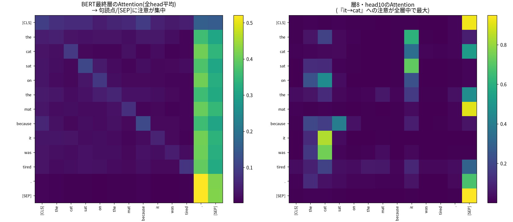

**読み取れる結果**: BERTの穴埋め予測(Masked LM)は「The movie was absolutely [MASK].」に対しfantastic/perfect/beautiful/amazing/fabulousと、映画レビューの文脈として自然な形容詞を高精度で予測できた一方、「I love this [MASK], it made me laugh.」ではman/girl/song/guy/womanとなり、期待される"movie"は出てこず、文脈理解には限界があることも分かった。Attentionの可視化では、BERT最終層を全head平均で見ると句読点や[SEP]に注意が集中する「attention sink」という既知の現象が支配的で、「it」が指す「cat」への注目は埋もれてしまっていたが、全12層×12headから探索すると層8・head10で「it→cat」への注意重みが0.835と際立って高く、Clark et al.(2019)が報告する照応解析に近い役割を持つheadの存在を実際に再現できた。GPT-2のテキスト生成では、貪欲法(greedy)が同じ入力から常に同じ安定した(やや単調な)文章を生成するのに対し、温度付きサンプリングは毎回異なる多様な文章を生成することを確認した。

### 図4: bert_finetune_project.png — ミニプロジェクト: BERTファインチューニングによる感情分析（[04_bert_finetune_project.py](stage8/04_bert_finetune_project.py)）

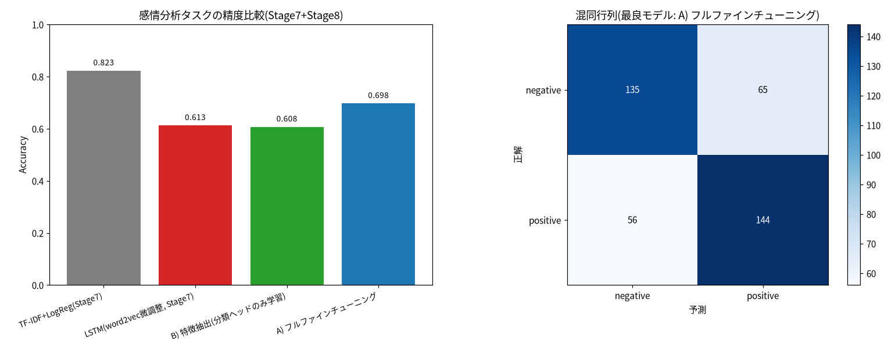

**実験設計**: Stage7のミニプロジェクトと全く同じmovie_reviewsの分割(訓練1600件・テスト400件)で、DistilBERTを (A) 全パラメータをファインチューニング / (B) 分類ヘッドのみ学習(特徴抽出) の2パターンで学習。CPU環境での学習時間を抑えるため、レビュー全文ではなく先頭128トークンに切り詰めて2epoch学習した。

**試行錯誤**: 当初max_length=256・3epochで設計したところ、1バッチ(16件)あたり12秒、1epoch=100バッチで約20分、4パターン(2手法×確認用)で2時間超という非現実的な時間が判明したため、max_length=128・2epochに縮小し、1手法あたり約8〜22分に短縮した。

**読み取れる結果**: 特徴抽出(分類ヘッドのみ学習)はAccuracy=0.608とほぼLSTM(0.613)と同水準にとどまり、学習中のloss推移も0.694→0.685とほとんど下がっていなかった。これは事前学習済みのBERTの表現力そのものは高くても、ランダム初期化の分類ヘッドを学習率2e-5(ファインチューニング向けの小さい値)だけで一から学習させるには不十分だったためと考えられる。一方フルファインチューニング(全パラメータ更新)はAccuracy=0.698まで改善し、loss も0.687→0.568と明確に下がった。Stage7の最良LSTM(0.613)は上回ったが、TF-IDF+ロジスティック回帰(0.823)には及ばなかった——2epoch・128トークンという限られた学習条件下では、事前学習済みTransformerの強みを完全には引き出しきれなかったと考えられ、より長い学習・全文入力・学習率調整でさらに向上する余地があることを示す結果となった。単語埋め込みだけを事前学習したword2vec(Stage7)と、Transformer全体を事前学習したBERT(Stage8)の差が、同じ小規模データでのファインチューニング結果に表れた形である。

## Stage 9: 生成モデル

[stage9/](stage9/) 配下にPythonスクリプトとして実装。`pip install diffusers accelerate`で拡散モデル系の
パッケージも追加インストールしたが、事前学習済みStable Diffusion系パイプラインはダウンロード・CPU推論が
非現実的に重かったため、後述の通りスクラッチ実装中心の構成に切り替えた。

| ファイル | 内容 |
|---|---|
| [01_vae_fashionmnist.py](stage9/01_vae_fashionmnist.py) | PyTorchでVAE(reparameterization trick含む)を実装し、Fashion-MNISTの潜在空間・生成画像を可視化 |
| [02_dcgan_fashionmnist.py](stage9/02_dcgan_fashionmnist.py) | PyTorchでDCGAN(Generator/Discriminator)を実装し、敵対的学習の過程と生成画像の推移を可視化 |
| [03_diffusion_scratch.py](stage9/03_diffusion_scratch.py) | DDPM(拡散モデル)の前向き/逆向き過程をスクラッチ実装し、小規模UNetでノイズ予測モデルを学習 |
| [04_vae_vs_gan_project.py](stage9/04_vae_vs_gan_project.py) | ミニプロジェクト: 自作VAEとGANの生成画像を多様性・識別性の定量指標で比較 |

**試行錯誤**: 当初ロードマップ通り「Diffusion Modelは簡易版をスクラッチしてから事前学習済みモデル(Stable Diffusion系)を試す」構成を予定していたが、`hf-internal-testing/tiny-stable-diffusion-pipe`はCLIPの解像度設定が不整合で生成時にエラーになり、`segmind/tiny-sd`はダウンロードだけで90秒以上かかり(モデルサイズがCPU実行の時間予算に対して大きすぎる)タイムアウトした。CIFAR-10の教訓と同様、事前学習済みStable Diffusion系はこの環境のCPU・回線条件では非現実的と判断し、事前学習済みモデルの利用は見送ってスクラッチ実装(VAE/GAN/Diffusion)に集中する構成に切り替えた。

### 図1: vae_fashionmnist.png — VAE(Variational Autoencoder)（[01_vae_fashionmnist.py](stage9/01_vae_fashionmnist.py)）

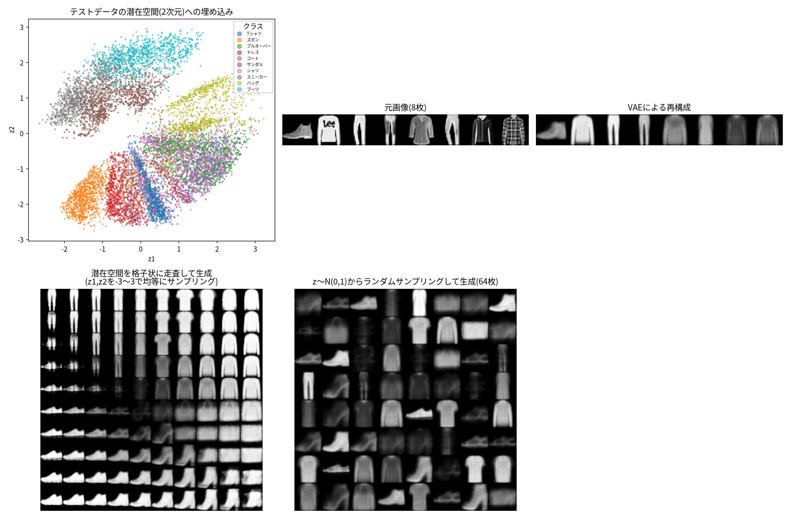

**読み取れる結果**: 可視化のため潜在次元を2に絞ってFashion-MNIST全クラスを学習(15epoch, 学習時間185秒)。テストデータを2次元潜在空間に埋め込むと、ブーツ/サンダル/スニーカーのような履物系クラスが左上に明確なまとまりを作り、ズボン(オレンジ)やバッグ(黄)も比較的まとまった領域を作る一方、Tシャツ/シャツ/コート/プルオーバーのような上半身の衣類同士は領域が重なり合っており、見た目が似ているクラス同士は潜在表現も近くなることを確認できた。潜在空間を格子状に走査すると、ブーツ系の形から別の形へなめらかに変化していく様子が見られ、通常のオートエンコーダにはない「潜在空間のなめらかさ」というVAEの特徴を視覚的に確認できた。再構成画像はぼやけた輪郭になる。

### 図2: dcgan_fashionmnist.png — DCGAN（[02_dcgan_fashionmnist.py](stage9/02_dcgan_fashionmnist.py)）

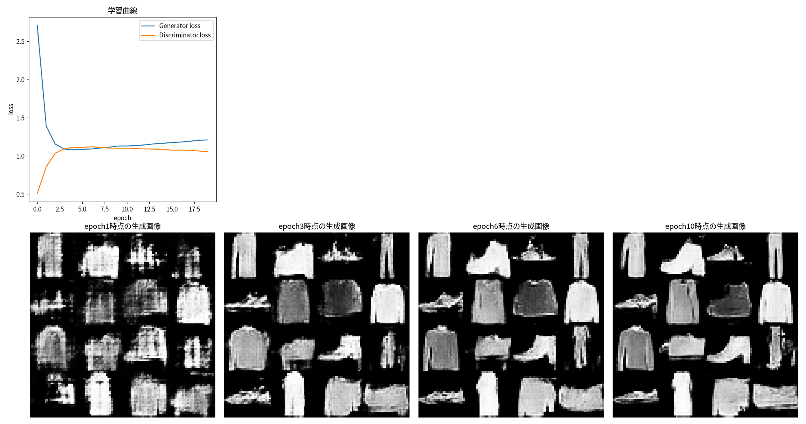

**読み取れる結果**: Fashion-MNIST全60,000枚を20epoch学習(学習時間3739秒、VAEの約20倍)。学習曲線はVAEのような単調減少ではなく、Generator lossとDiscriminator lossが互いに反応し合いながら1.0〜1.2付近で拮抗する典型的なGANの挙動を示した。epoch1時点ではほぼノイズだった生成画像が、epoch3・6・10と進むにつれてズボン・スニーカー・コートらしいはっきりした輪郭を持つ形へと明確に変化していく様子を確認でき、VAEの再構成画像よりもくっきりした生成結果が得られた。

### 図3: diffusion_forward_process.png / diffusion_scratch.png — スクラッチDDPM（[03_diffusion_scratch.py](stage9/03_diffusion_scratch.py)）

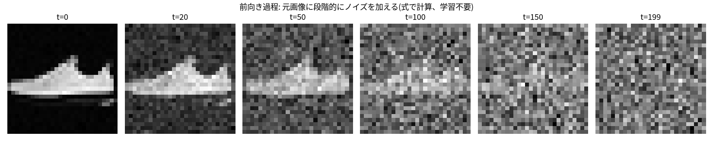
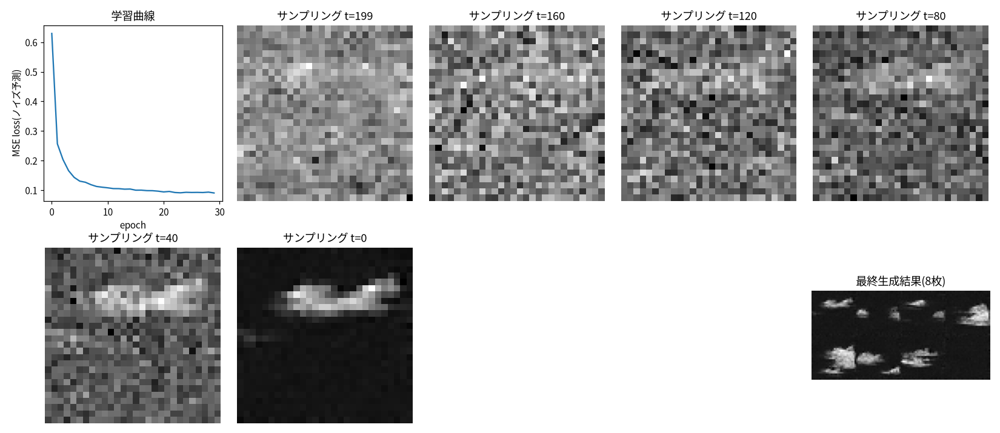

**読み取れる結果**: cosine noise scheduleに沿って元画像に200ステップかけてノイズを加える前向き過程を可視化すると、t=0の明瞭なスニーカーがt=199でほぼ完全なノイズになる様子が確認できた。ノイズ予測ネットワーク(2段の小型UNet)をスニーカークラス6000枚・30epochで学習(学習時間470秒)し、逆向き過程でt=199の完全なノイズからt=0まで200ステップかけてサンプリングすると、ノイズの中から明るい塊(スニーカーのおおまかなシルエット)が浮かび上がる過程は確認できたが、最終的な生成画像はVAE・GANほど輪郭がくっきりせず、ぼんやりした明るい塊にとどまった。ノイズ予測のMSE lossも0.09台で下げ止まっており、CPU実行時間を優先してモデル・データ・epoch数を大幅に縮小した結果、収束しきっていないことが分かる——「仕組みは同じでもスケール(モデルサイズ・データ量・学習量)が生成品質を大きく左右する」という、実際のDDPM論文やStable Diffusionとの規模の違いを逆に体感する結果となった。一方で、VAE・GANが1回のネットワーク呼び出しで生成するのに対し、Diffusion Modelは1枚の生成に200回のネットワーク呼び出しを要するという生成の仕組みの違いは明確に確認できた。

### 図4: vae_vs_gan_project.png — ミニプロジェクト: VAE vs GAN比較（[04_vae_vs_gan_project.py](stage9/04_vae_vs_gan_project.py)）

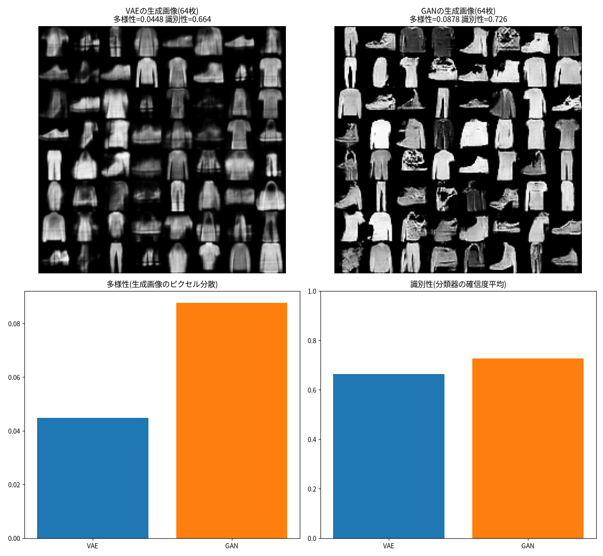

**実験設計**: Fashion-MNIST全クラスでVAE(10epoch)・GAN(10epoch)を学習し、生成画像64枚ずつを (1) ピクセル単位の分散(多様性の目安) (2) 別途学習した簡易CNN分類器(テスト精度0.889)の予測確信度の平均(識別性の目安、簡易Inception Score) の2指標で比較。

**読み取れる結果**: 多様性・識別性のどちらもGAN(多様性0.088, 識別性0.726)がVAE(多様性0.045, 識別性0.664)を上回った。これは「VAEの方が潜在空間全体からなめらかにサンプリングできるため多様性で有利」という教科書的な説明とは逆の結果である。生成画像を見比べると、VAEは画素ごとの再構成誤差を平均的に最小化する性質上、輪郭がぼやけて中間的な明るさの画素が多くなり、結果としてピクセル分散自体が小さく計算されやすい一方、GANはくっきりした白黒のコントラストを持つ画像を生成するため画素値が0/1付近に分かれやすく、単純なピクセル分散という指標では「鮮明さ」が「多様性」と混同されて高く出ている可能性がある。今回使った簡易指標が意味的な多様性と画像の鮮明さを完全には切り分けられていないという、評価指標そのものの限界も合わせて確認できた。GANの学習時間(1824秒)はVAE(127秒)の約14倍で、02で確認した学習の重さもあらためて裏付けられた。

## Stage 10: LLM関連・学習戦略

[stage10/](stage10/) 配下にPythonスクリプトとして実装。`pip install peft google-genai`を追加インストールした。
RAG部分は[260525/phase1/rag_phase1.py](../260525/phase1/rag_phase1.py)の最小RAG実装(チャンク分割→Embedding→
コサイン類似度検索→LLM回答生成)の手順を踏襲しつつ、このリポジトリ自身のroadmap.mdをドキュメントとして使った。

| ファイル | 内容 |
|---|---|
| [01_lora_scratch.py](stage10/01_lora_scratch.py) | numpyでLoRA(低ランク差分ΔW=B@A)をスクラッチ実装し、フルファインチューニングとパラメータ数・精度を比較 |
| [02_lora_finetune_gpt2.py](stage10/02_lora_finetune_gpt2.py) | peftライブラリでGPT-2に実際にLoRAを適用し、架空の知識を暗記させられるか実験 |
| [03_rag_and_cot.py](stage10/03_rag_and_cot.py) | Gemini APIでroadmap.mdを対象としたRAGパイプラインと、Chain-of-Thoughtプロンプトを試す |
| [04_lora_vs_rag_project.py](stage10/04_lora_vs_rag_project.py) | ミニプロジェクト: 同一のGPT-2・同一の架空知識で「適応なし/LoRA/RAG」を比較 |
| [fictional_facts.py](stage10/fictional_facts.py) | 02・04で共有する、GPT-2が確実に知らない架空企業の設定文とQ&Aペア |

**試行錯誤**: Gemini APIの無料枠は`gemini-2.5-flash`が1日あたり20リクエストという上限があり、03の実行中に上限に達してエラーになった。`gemini-flash-latest`という同等モデルに切り替えることで解決し、以後はレート制限(429)に対する自動リトライ(指数バックオフ)も組み込んだ。

### 図1: lora_scratch.png — numpyスクラッチLoRA（[01_lora_scratch.py](stage10/01_lora_scratch.py)）

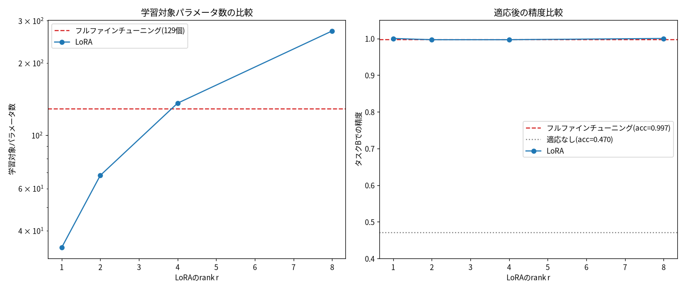

**試行錯誤**: 当初タスクA→タスクBへの適応を「クラスの中心を平行移動させる」形で設計したが、たまたま決定境界の向き(入力のx座標だけを見る境界)が変わらない移動だったため、適応前でもタスクBを精度0.987で解けてしまい、適応の効果を測定できなかった。決定境界の向きそのものが90度変わる(x座標で分けるタスク→y座標で分けるタスク)よう設計し直すことで、適応前は精度0.470(ランダム相当)に落ち込み、適応の効果を正しく測定できるようになった。

**読み取れる結果**: フルファインチューニング(129パラメータ)は精度0.997まで回復させたのに対し、LoRAは最小のrank=1(34パラメータ、フルの1/4)でも精度1.000に到達し、rank=2〜8にしてもほぼ同じ精度にとどまった。今回のタスクは決定境界の向きを1方向切り替えるだけの単純な変化だったため、最小rankの低ランク差分だけで十分に表現できたと考えられる。

### 図2: 02(LoRAでGPT-2に架空知識を注入)（[02_lora_finetune_gpt2.py](stage10/02_lora_finetune_gpt2.py)、図なし・コンソール出力）

**読み取れる結果**: GPT-2(124M)にpeftでLoRA(target_modules=["c_attn"], r=8)を適用すると学習対象パラメータは全体のわずか0.236%(294,912個)。架空企業「Zorvenix Technologies」に関する6つのQ&Aで、ファインチューニング前は0/6(架空設定なので当然)、LoRAファインチューニング後(5epoch)は2/6正解に改善した。厳密な一致判定では不正解になった質問でも、生成文には「Nubrium」「Corvex」等の固有名詞が正しく登場しており、部分的な知識の学習は確認できた。

### 図3: 03(RAG + Chain-of-Thought)（[03_rag_and_cot.py](stage10/03_rag_and_cot.py)、図なし・コンソール出力）

**読み取れる結果**: roadmap.mdを45チャンクに分割してRAGパイプラインを構築し、「Stage 9のミニプロジェクトは何か」と質問したところ、興味深い失敗が観察された——正解のチャンク(自作VAEとGANでの画像生成結果を比較)は類似度で6位(score=0.720)に沈み、top_k=3にわずかに入らなかったため、実際に渡された文脈にはStage 11(量子化)の内容が混入し、LLMは「量子化前後でのモデルサイズ・推論速度比較」という誤った回答を確信的に返した。文脈なしの回答が正直に「情報がない」と答えていたのに対し、中途半端に関連する誤情報を与えられたRAGの方がもっともらしい誤答をしてしまうという、RAG運用上の重要な教訓が得られた。Chain-of-Thoughtの実験では、りんご・みかんの購入問題に対し直接プロンプト・CoTプロンプトのどちらも正解(20円)に到達したが、CoTは計算過程(480円→残り20円→追加購入不可)を明示するため、複雑な問題での検証可能性という点で実務的な価値があることを確認した。

### 図4: lora_vs_rag_project.png — ミニプロジェクト: 同一GPT-2でのLoRA vs RAG比較（[04_lora_vs_rag_project.py](stage10/04_lora_vs_rag_project.py)）

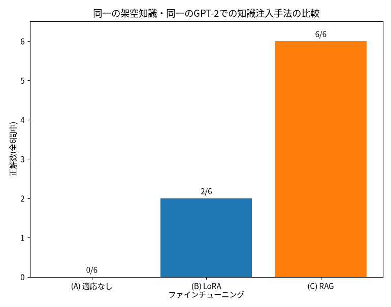

**読み取れる結果**: 同一のGPT-2・同一の架空知識(Zorvenix Technologies)で、(A)適応なし=0/6、(B)LoRA=2/6、(C)RAG(TF-IDF検索+ベースGPT-2)=6/6という結果になった。RAGが圧勝した理由は、6つの短い事実文から1問1答で聞いているため単純なTF-IDF検索でも正解チャンクをほぼ確実に引き当てられたため。02・03で確認した通り、LoRAは推論時に検索が不要というメリットがあるが少量データでは完全な暗記に至りにくく、RAGは検索精度に強く依存する(03で見た検索失敗の実例)というトレードオフが、小規模な実験からも裏付けられた。

## Stage 11: モデル軽量化

[stage11/](stage11/) 配下にPythonスクリプトとして実装。Stage5の[synthetic_shapes.py](stage5/synthetic_shapes.py)
(合成図形データセット)を再利用した。

| ファイル | 内容 |
|---|---|
| [01_pruning.py](stage11/01_pruning.py) | 非構造化/構造化プルーニングでスパース率と精度の関係を実測 |
| [02_quantization.py](stage11/02_quantization.py) | PyTorchの訓練後静的量子化(float32→int8)でサイズ・速度・精度を比較 |
| [03_knowledge_distillation.py](stage11/03_knowledge_distillation.py) | 知識蒸留で大きい教師モデルの知識を小さい生徒モデルに移す |
| [04_quantization_project.py](stage11/04_quantization_project.py) | ミニプロジェクト: モデル設計の縮小×量子化を掛け合わせた圧縮効果を測定 |

### 図1: pruning.png — プルーニング（[01_pruning.py](stage11/01_pruning.py)）

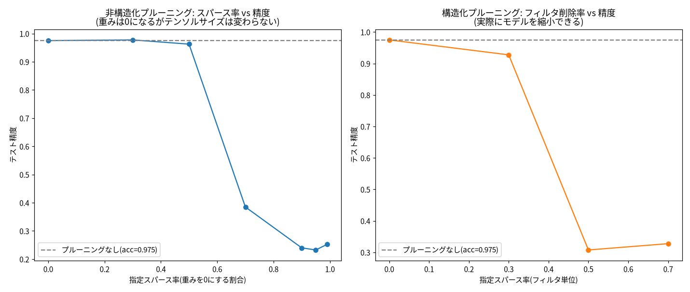

**試行錯誤**: `torch.nn.utils.prune`適用後、`model.parameters()`経由で非ゼロパラメータ数を数えると常に0%スパースと表示される不具合に遭遇した。これはprune APIが元の重み`weight_orig`をパラメータとして保持したまま、マスク適用後の値を`.weight`として都度計算する仕組みのためで、`model.parameters()`ではなく各Conv2d/Linear層の実効的な`.weight`属性を直接参照するよう修正した。また、当初8epochの学習ではベース精度が0.635と低く比較の土台として不十分だったため、20epochに増やして精度0.975まで引き上げた。

**読み取れる結果**: 非構造化プルーニングは重みの50%を0にしてもテスト精度0.962とほぼ無傷だったが、70%まで間引くと0.385まで急落する崖が見られた。構造化プルーニング(フィルタ単位)はさらに崖が早く訪れ、30%のフィルタ削除ではほぼ無傷(0.928)だったのに対し50%削除では0.308(4クラス問題のランダム水準0.25に近い)まで崩壊した。重要な注意点として、非構造化プルーニングは重みを0にするだけでテンソルの形は変わらないため、そのままではモデルファイルサイズも推論速度も変化しない。

### 図2: quantization.png — 量子化（[02_quantization.py](stage11/02_quantization.py)）

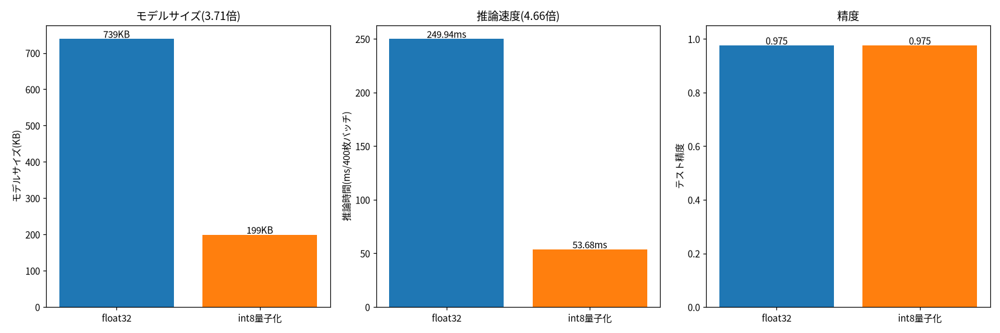

**読み取れる結果**: 訓練後静的量子化(Conv+ReLU融合→キャリブレーション→int8変換)により、モデルサイズは738.7KB→199.1KB(3.71倍圧縮)、推論時間は249.94ms→53.68ms(4.66倍高速化)を達成し、精度は0.975→0.975で全く劣化しなかった。プルーニングと異なり、量子化は重みの表現形式そのものを変えるため、特別な疎行列ライブラリなしに保存・読み込みするだけでサイズ削減の恩恵をそのまま受けられることを確認した。

### 図3: knowledge_distillation.png — 知識蒸留（[03_knowledge_distillation.py](stage11/03_knowledge_distillation.py)）

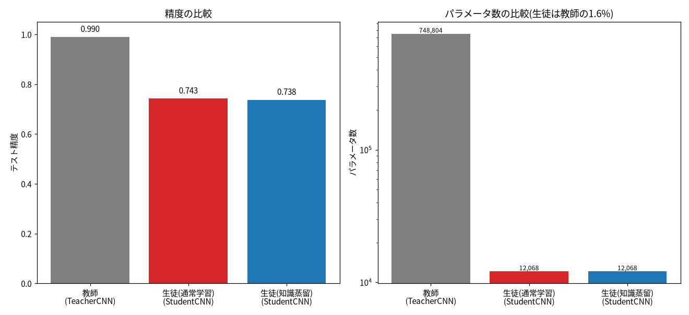

**試行錯誤**: 初期設定(温度T=4.0, 蒸留損失の重みα=0.7)では知識蒸留後の精度が通常学習より大幅に低い結果(0.545 vs 0.743)になった。ハイパーパラメータを探索(α=0.3/0.5, T=1.0/2.0/4.0)し、最良のT=2.0・α=0.5でも通常学習(0.743)をわずかに下回る0.738にとどまった。

**読み取れる結果**: 生徒モデル(教師のわずか1.6%のパラメータ数)は通常学習でも精度0.743を達成し、知識蒸留を使っても0.738と明確な改善は見られなかった。教師モデル自身がテスト精度0.990とほぼ完璧にタスクを解けてしまうほどシンプルな課題だったため、教師の出力確率分布がほぼone-hotに近く、正解ラベルだけでは伝わらない「クラス間の類似度」情報がそもそも乏しかったことが原因と考えられる。知識蒸留は、教師自身が完璧ではなく意味のある混同パターンを残すような、より難しいタスクでこそ効果を発揮するという理論的な性質を、逆説的に実験で裏付ける結果となった。

### 図4: quantization_project.png — ミニプロジェクト: モデル設計×量子化（[04_quantization_project.py](stage11/04_quantization_project.py)）

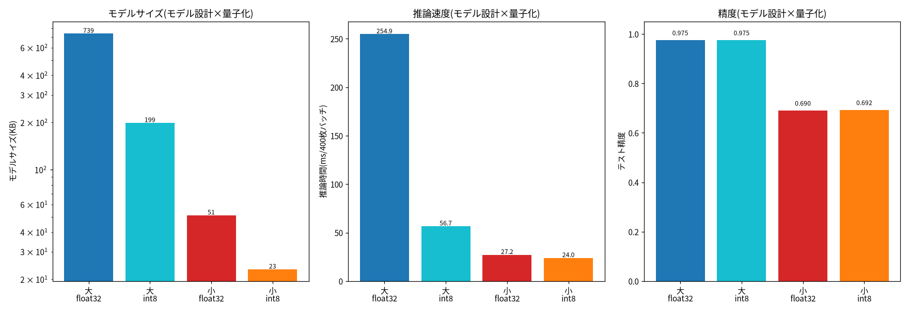

**読み取れる結果**: 大きいモデル(float32, 739KB)を基準に、小さい設計(base_ch=8)にする効果が14.4倍、そこにさらに量子化を重ねる効果が2.2倍で、合計31.9倍のサイズ圧縮(739KB→23KB)を達成した。2つの軽量化手法(モデル設計の縮小・量子化)はほぼ独立に効き、掛け算的に効果が積み上がることを確認した。一方で精度は0.975(大きいモデル)→0.692(小さいモデル、量子化後は0.692とほぼ同じ)まで低下しており、軽量化と精度は明確なトレードオフの関係にあることも実測できた。

## Stage 12: 強化学習

[stage12/](stage12/) 配下にPythonスクリプトとして実装。`pip install gymnasium`を追加インストールした。

| ファイル | 内容 |
|---|---|
| [01_bandit_exploration.py](stage12/01_bandit_exploration.py) | 多腕バンディット問題でε-greedy/UCB方策と探索・活用のトレードオフを実装 |
| [02_qlearning_sarsa_frozenlake.py](stage12/02_qlearning_sarsa_frozenlake.py) | Q学習/SARSAをFrozenLakeでスクラッチ実装し、学習曲線と方策を可視化 |
| [03_dqn_cartpole.py](stage12/03_dqn_cartpole.py) | PyTorchでDQN(Experience Replay + Target Network)を実装しCartPoleで学習 |
| [04_cartpole_project.py](stage12/04_cartpole_project.py) | ミニプロジェクト: DQN(価値ベース) vs REINFORCE(方策勾配法)でCartPole攻略を比較 |

### 図1: bandit_exploration.png — 多腕バンディット（[01_bandit_exploration.py](stage12/01_bandit_exploration.py)）

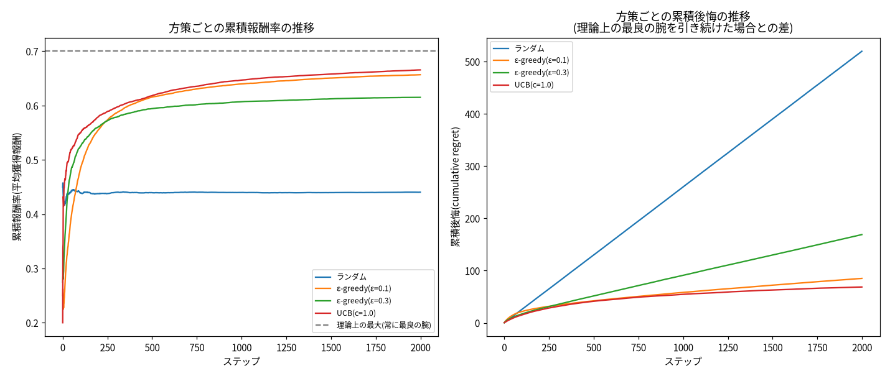

**読み取れる結果**: 2000ステップ・200試行平均で、UCB(c=1.0)が累積後悔68.7と最小を記録し、ε-greedy(ε=0.1)の85.1、ε-greedy(ε=0.3)の169.0、ランダム方策の519.8を上回った。ランダム方策は後悔が線形に増え続けるのに対し、ε-greedy・UCBは学習が進むにつれて累積後悔の増加が緩やかになる様子が明確に確認でき、教科書的な理論(UCBの対数オーダー後悔)を裏付ける結果となった。

### 図2: qlearning_sarsa_frozenlake.png — Q学習/SARSA（[02_qlearning_sarsa_frozenlake.py](stage12/02_qlearning_sarsa_frozenlake.py)）

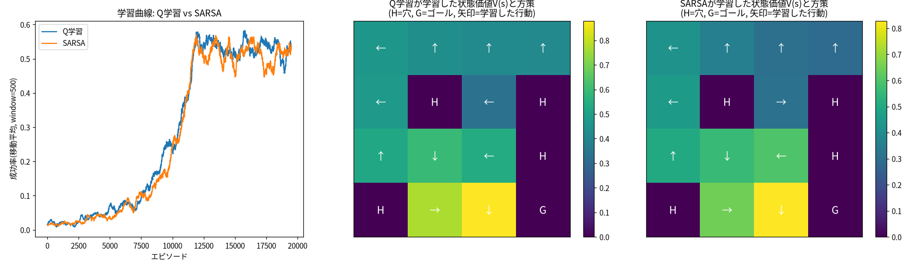

**読み取れる結果**: is_slippery=TrueのFrozenLake(4x4)を20000エピソード学習した結果、Q学習・SARSAともに最終成功率0.51〜0.52程度で頭打ちになった(確率的な状態遷移のため成功率1.0には到達しない)。理論的にはQ学習は次状態の最善行動を仮定し、SARSAは実際の探索方策込みで更新するため、穴に近い状況ではSARSAの方が保守的な方策になりやすいとされるが、実際に学習された16マスの方策を比較すると異なる行動を選んでいたのは1マスのみで、この規模のタスクでは両手法の違いが方策に大きく表れるほどではなかった。

### 図3: dqn_cartpole.png — DQN（[03_dqn_cartpole.py](stage12/03_dqn_cartpole.py)）

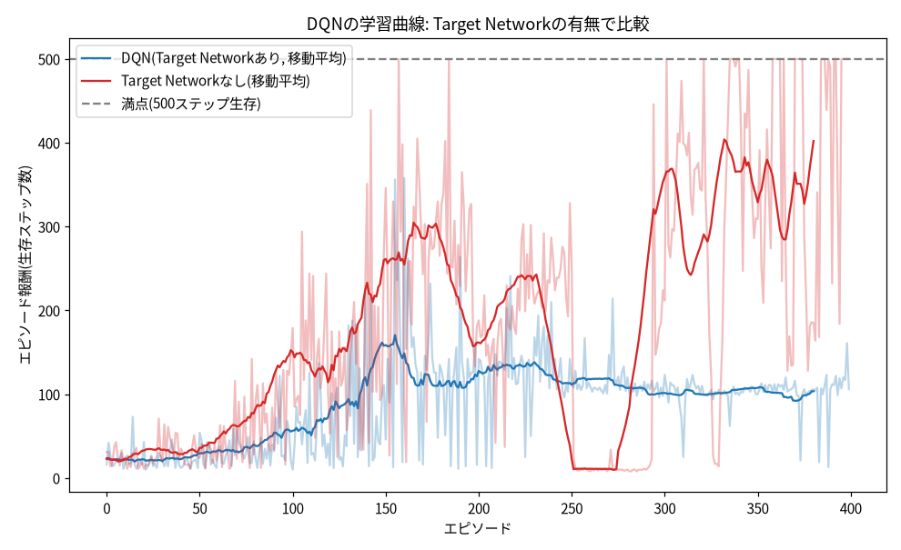

**試行錯誤**: 当初「Target Networkありが終始安定して優れている」という単純な結論を想定していたが、実際には学習序盤〜中盤でTarget Networkなしの方が高い成績を記録することもあり、スクリプトを複数回実行するとTarget Networkあり・なしのどちらが最終成績で上回るかが入れ替わることが分かった。

**読み取れる結果**: vanilla DQNは400エピソード程度の学習では本質的に高分散な学習曲線(移動平均でも大きく乱高下し、時に一時的な性能崩壊も見せる)をたどりやすいことを実測した。これは実装ミスではなく、深層強化学習でよく知られた性質であり、論文等で複数の乱数シードの平均を報告するのが標準的な作法である理由を体感する結果となった。一方で、Target Networkがない場合の急激な性能低下(catastrophic forgettingに近い現象)は両方の実行で共通して観測され、理論通りの不安定化の兆候として裏付けられた。

### 図4: cartpole_project.png — ミニプロジェクト: DQN vs REINFORCE（[04_cartpole_project.py](stage12/04_cartpole_project.py)）

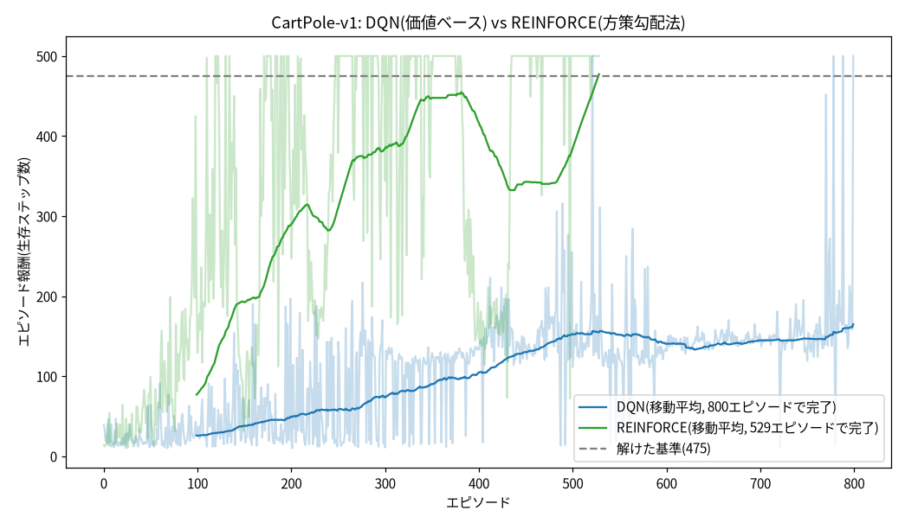

**読み取れる結果**: REINFORCE(方策勾配法)は529エピソードで「解けた」基準(直近100エピソード平均報酬475以上)に到達し最終平均477.2を記録した一方、DQN(価値ベース法)は上限800エピソードまでに基準に届かず、最終平均164.8にとどまった。「DQNの方がサンプル効率が良い」という一般的な期待とは逆の結果になったが、03で確認した通りvanilla DQNの学習は本質的に高分散であり、今回のハイパーパラメータ・乱数シードの組み合わせではREINFORCEの方がたまたま安定して学習が進んだと考えられる。価値ベース法(Q値を経由して間接的に行動を決める)と方策ベース法(行動確率を直接最適化する)という設計思想の違いを、同一タスクでの実装・実行を通じて確認できた。

## Stage 13: 探索アルゴリズム（古典AI）

[stage13/](stage13/) 配下にPythonスクリプトとして実装。機械学習ではないが、強化学習・ゲームAIの前提知識として関連が深い古典的な探索アルゴリズムを、三目並べ(〇×ゲーム)を題材に実装した。盤面表現とルールは[tictactoe.py](stage13/tictactoe.py)に共通モジュールとして切り出し、02以降で再利用した。

| ファイル | 内容 |
|---|---|
| [01_bfs_dfs_maze.py](stage13/01_bfs_dfs_maze.py) | BFS(幅優先探索)/DFS(深さ優先探索)を迷路探索でスクラッチ実装し、最短性・展開ノード数を比較 |
| [02_minimax_tictactoe.py](stage13/02_minimax_tictactoe.py) | Mini-Max法を三目並べに全探索でスクラッチ実装し、必勝手・引き分け確定を確認 |
| [03_alphabeta_mcts_tictactoe.py](stage13/03_alphabeta_mcts_tictactoe.py) | αβ法(Mini-Max法の枝刈り)とMCTS(モンテカルロ木探索)をスクラッチ実装し比較 |
| [04_tictactoe_project.py](stage13/04_tictactoe_project.py) | ミニプロジェクト: αβ法「不敗」AIを複数種類の相手と計310局対戦させ実証 |

### 図1: bfs_dfs_maze.png — BFS/DFS（[01_bfs_dfs_maze.py](stage13/01_bfs_dfs_maze.py)）

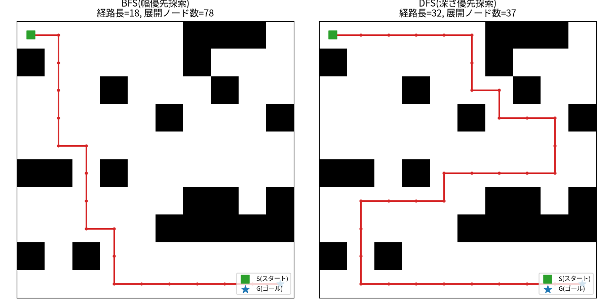

**試行錯誤**: 当初、通路の少ない一本道に近い迷路で試したところBFS/DFSの経路長が常に一致してしまい(迂回可能なルートが存在しないため)、「DFSは最短性を保証しない」という性質を実際には示せていなかった。疎な壁配置(乱数生成、シード探索で複数経路が存在する迷路を選定)に変更したことで、BFSの経路長18に対しDFSは32となり、性質の違いを実際のデータで示せた。

**読み取れる結果**: BFSは展開ノード数78で経路長18(最短)を発見したのに対し、DFSは展開ノード数37(BFSの半分弱)で経路長32の経路しか見つけられなかった。DFSは一本道を掘り進めて行き止まりに突き当たるたびに戻るため探索対象ノード数は少なく済む一方、見つかる経路の最短性は保証されないというトレードオフが明確に確認できた。

### 図2: minimax_tictactoe.png — Mini-Max法（[02_minimax_tictactoe.py](stage13/02_minimax_tictactoe.py)）

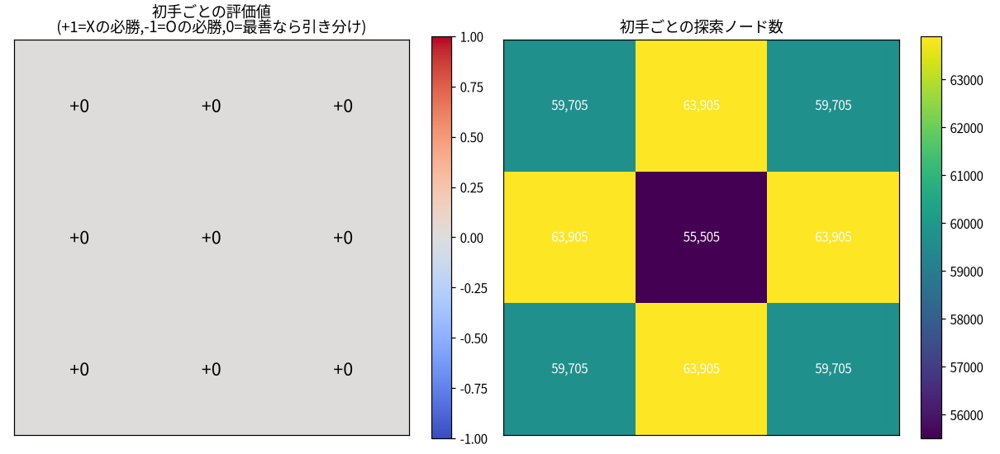

**読み取れる結果**: 空の盤面からの全探索は549,946ノードを要し、評価値は0(引き分け)、9通りの初手すべてが評価値0で並んだ——三目並べは双方が最善を尽くせば必ず引き分けになるゲームであることが全探索によって裏付けられた。一方で探索ノード数は初手によって55,505(中央)〜63,905(辺)まで差があり、盤面の対称性・早期決着分岐の多さがコストに影響することも確認できた。ランダムな相手との100局では、Mini-Max側(X)の勝ち99・引き分け1・負け0となり、相手がミスをする場合は理論上の下限(引き分け)を上回る結果(勝ち)を引き出せることも実証できた。

### 図3: alphabeta_mcts_tictactoe.png — αβ法とMCTS（[03_alphabeta_mcts_tictactoe.py](stage13/03_alphabeta_mcts_tictactoe.py)）

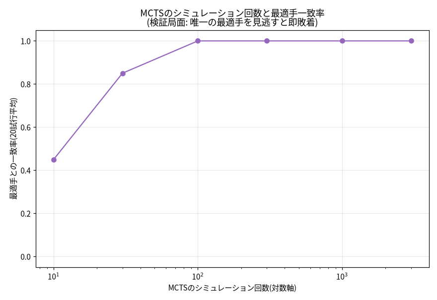

**読み取れる結果**: αβ法は素朴なMini-Max法と全く同じ評価値・最善手を18,297ノード(素朴な方式の3.3%、96.7%削減)で得られ、枝刈りが結果を変えずに探索コストだけを削減できることを確認した。MCTSについては、Oの二重の勝ち筋を同時に阻止できる手が1つしかない検証局面(X O X / . O . / . . .、正解はマス7のみ)を使い、シミュレーション回数10回では最適手との一致率45%だったのに対し、100回以上では20試行全てで最適手に一致(100%)した。全探索が可能な小規模ゲームでも、統計的探索(MCTS)が回数を重ねるほど厳密解に収束していく様子を実際に確認できた。

### 図4: tictactoe_project.png — ミニプロジェクト: αβ法「不敗」AI（[04_tictactoe_project.py](stage13/04_tictactoe_project.py)）

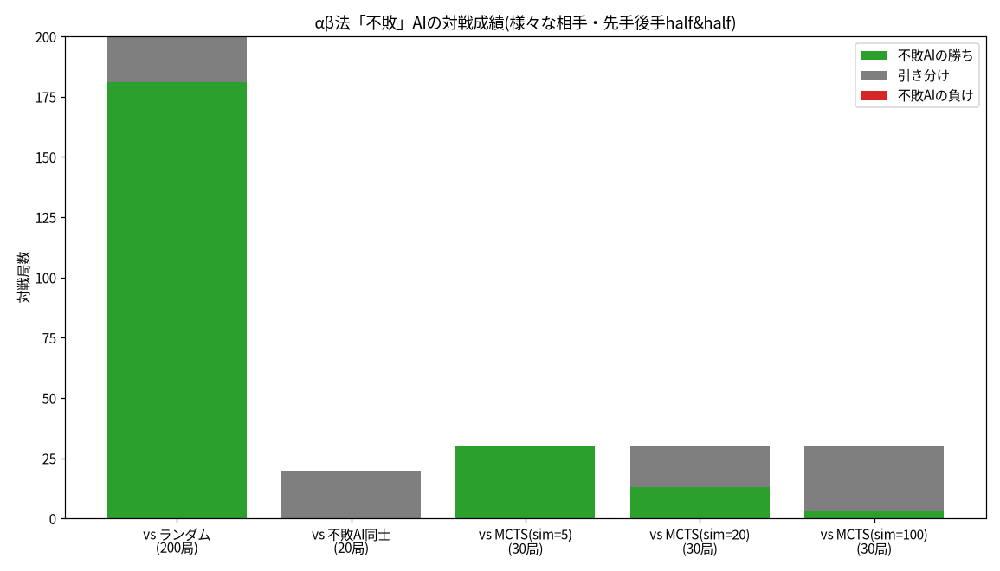

**読み取れる結果**: 先手・後手を半々ずつ担当させ、ランダムな相手200局・自分自身(αβ法同士)20局・MCTS(シミュレーション5/20/100回)各30局の合計310局を対戦させた結果、αβ法AIの負けは0回だった。自分自身との対戦は全局引き分けとなり(02の結論と整合)、MCTS相手はシミュレーション回数を5→20→100回と増やすにつれ引き分け率が0%→57%→90%と上昇し「不敗AIの勝ち」が「引き分け」に置き換わっていく一方、負けだけは最後まで発生しなかった。Mini-Max法(αβ法)の理論的保証(相手がどれだけ強くなっても最悪の結果は引き分けまで)が、実際の対戦シミュレーションでも一貫して成り立つことを実証できた。
